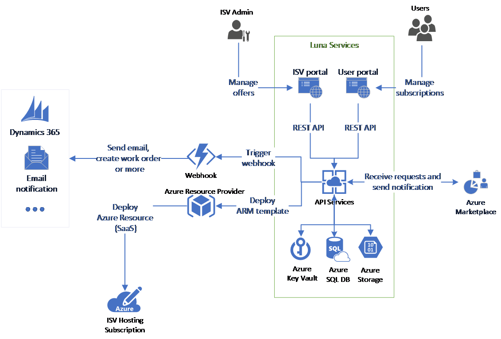

# Sell your application through Azure Marketplace SaaS offer using Project Luna
## Overview
Publishing your applications in Azure Marketplace and enabling transaction through Microsoft allows users to discover and subscribe your applications directly from Azure portal. It dramatically increases the visibility of your applications. However, publishing a SaaS offer and enable transaction through Microsoft usually required extra coding work in your application, including enabling AAD authentication, implementing the fulfillment API, billing API and the user landing page. This work is non-trivial especially if you are not familiar with Azure.

## What is Project Luna?
Project Luna provides a SaaS application template, which allows Microsoft partners publish applications in Azure Marketplace with zero to minimum coding effort:
- Project Luna implemented the fulfillment APIs and meter APIs (under development) and provided a configuration-based integration experience for Marketplace SaaS offers.
- Project Luna provides a partner management portal where you can manage all your offers and user subscriptions.
- Project Luna allows you automate user transactions and operations using ARM templates, or webhooks. 
- Project Luna provides a default user landing page and a user management page where user can manage their subscriptions.
- Secured by Azure Active Directory authentication.
- Project Luna is an open source project. It is highly customizable and extensible. 

## Who is Project Luna for?
Project Luna is for Microsoft partners who wants to sell their applications or services in Azure Marketplace and enable transaction through Microsoft. 

If you want to sell your application through Microsoft but you don’t have enough resource to implement all the required APIs and UIs, Project Luna can help you to enable a SaaS offer deployment and connect to Azure Marketplace with zero to minimum coding effort. All you need to do is deploying Luna service to your subscription and configure the offer in the management portal.

If you have enough dev resource and time, Project Luna can also be a good starting point. Project Luna provides decoupled web UI and backend API services, you can easily create your own web UI or extend your current UI experience and plug-in the Luna functionalities by calling the backend API service. Project Luna is built on top of a simple data model, which you can extend and add your own functions and business logic.

## Architecture Overview
Following is the architecture diagram of Project Luna:
- The ISV portal and user portal are created as React applications and deployed to Azure webapp services.
- The API application is a .netcore Azure webapp. It is the central piece of the service.
  - It handles all the requests from ISV and user portal. 
  - It receives and sends requests from/to Azure Marketplace through the fulfillment APIs. 
  - It orchestrates the application provisioning workflow, deploys the ARM template and/or triggers webhook per user definition.
- A webjob is deployed together with the API application to manage the application provisioning workflow.
- Azure key vault is used to store all the credentials, including SQL connection string, storage key and Azure Active Directory application secrets.
- Azure SQL Database is used to store service metadata.
- Azure storage account is used to store ARM template files.
- Azure Active Directory authentication is used in all the UI webapp and for communication between different services in Project Luna.

## How to use Project Luna
Project Luna is very easy to use. You can deploy Luna services to your own Azure subscription from a single PowerShell command. It deploys and configures all the Azure resources and Azure Active Directory applications. After the deployment, you can follow the guidance on the ISV management portal to create and configure your offer. 

For more details, please see the Project Luna documentation:

- [How to deploy Luna services?](Resources/Documentation/deploy_luna_services.md)
- [How to configure and manage offer?](Resources/Documentation/configure_and_manage_offers.md)
- [How to manage user subscriptions?](Resources/Documentation/manage_user_subscriptions.md)
- [Learn about end user experience.](Resources/Documentation/end_user_experience.md)

## Feedback
If you have any feedback or feature request, please open an issue in this GitHub repo. We will triage all the issues regularly. Due to the resource limit, we can’t guarantee solving all the issues on time. You can also contribute to the project directly by submitting a pull request for your code change. We will review, test and merge your changes. Your contribution to the project will be very appreciated. 