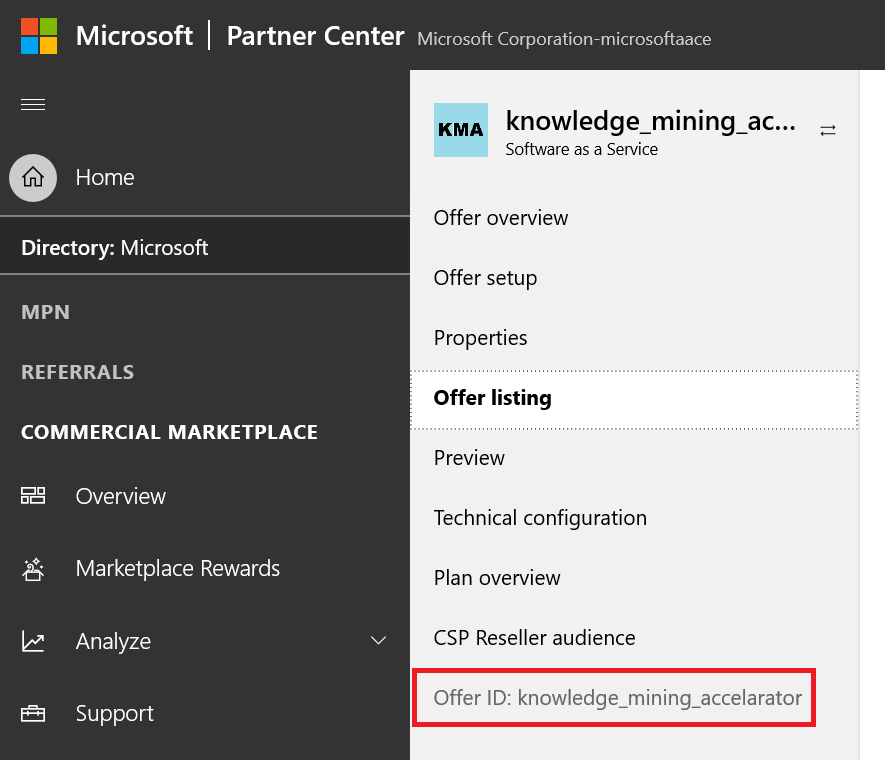
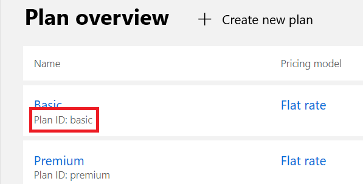
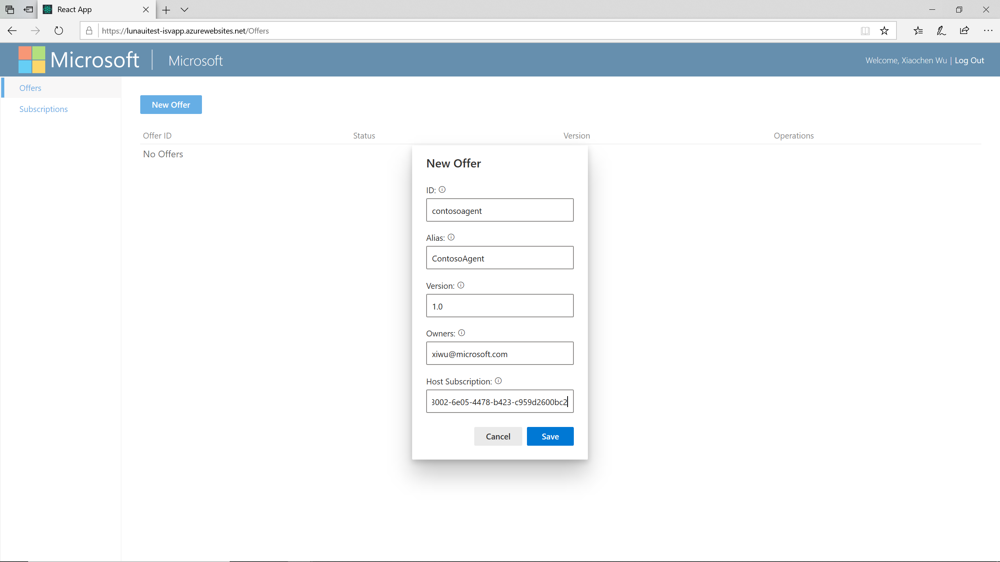
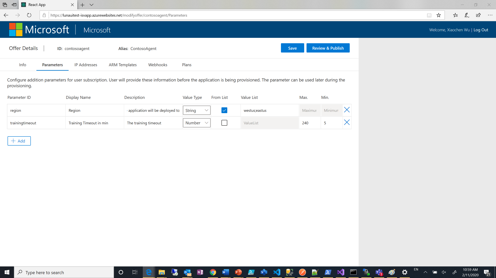
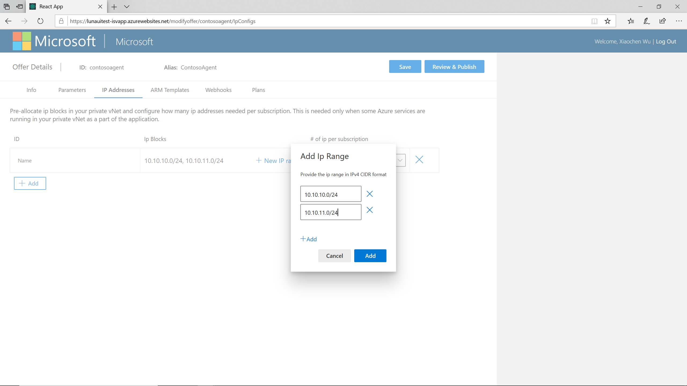
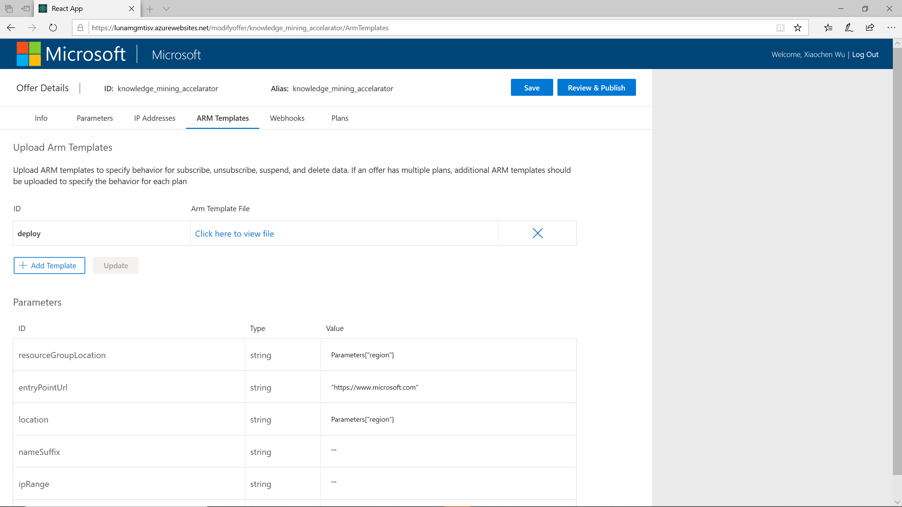
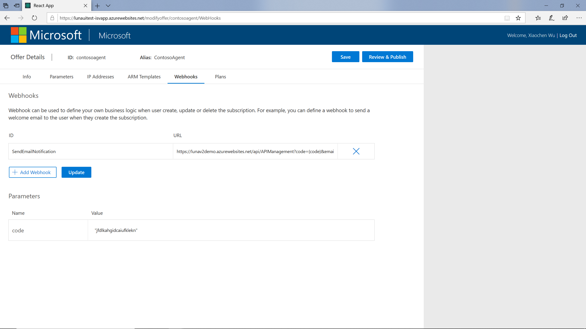
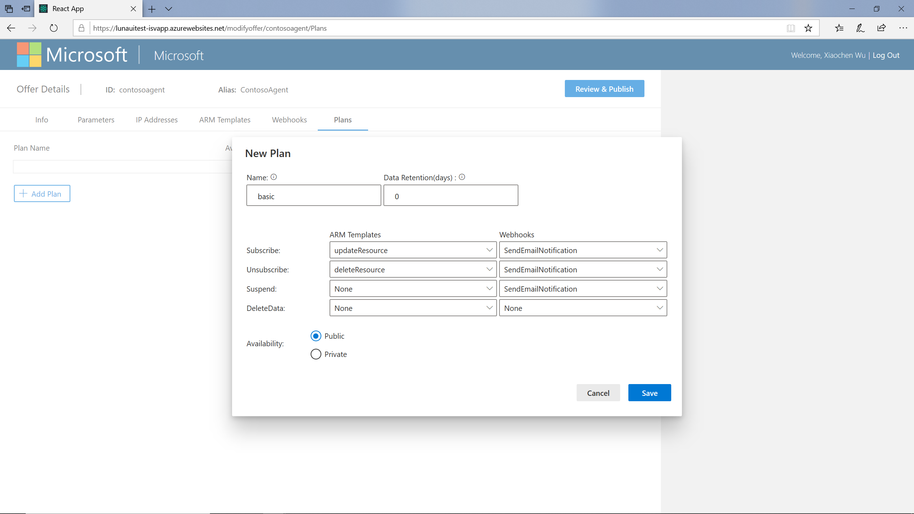

# Configure and manage a SaaS offer in Luna and Azure Marketplace

This document will show you how to create a SaaS offer using Luna Service and Microsoft Partner Center

## Prerequisites
- Follow the [instruction](deploy_luna_service.md) to deploy Luna service to your subscription. If you are deploying Luna service using the PowerShell script, it will print out all the information you need to create a SaaS offer.
- Setup your Microsoft partner account. For more information, see [Microsoft Partner Center](https://partner.microsoft.com).
- [optional] Have your marketing and legal information ready. You can also add these after the offer is created. See the [SaaS offer creation check list](https://docs.microsoft.com/azure/marketplace/partner-center-portal/offer-creation-checklist) for more details.

In the following instruction, we will create an offer called ContosoMLAgent with two different plans: basic and standard.

## Create SaaS offer in Microsoft Partner Center
This step will provide all information Azure Marketplace needed to sell your application through Microsoft channels, including marketing, legal and technical configuration. In this document, we will only focus on the technical configurations.

After login to the [Microsoft Partner Center](https://partner.microsoft.com), you can open the partner center dashboard by click on the “dashboard” link. You can follow the [Azure Marketplace instruction](https://docs.microsoft.com/azure/marketplace/partner-center-portal/create-new-saas-offer) to create your SaaS offer.

At the Technical Configuration section, you will specify the following values from Luna service:
- **Landing page URL**: it is provided by the user web app. The URL should be: https://<user_webapp_name>.azurewebsites.net/LandingPage. 
- **Connection webhook**: it is provided by the API web app. The webhook URL should be: https://<api_webapp_name>.azurewebsites.net/webhook. 
- **Azure Active Directory tenant ID**: it is the tenant id for the Azure Marketplace AAD application
- **Azure Active Directory application ID**: it is the client/application id for the Azure Marketplace AAD application

After the offer draft is created, you will need following information to continue:
- **Offer id**: you can find it under the menu of offer configuration page

- **Plan ids**: you can find it on the Plan overview page. Use the plan id instead of plan name:

## Create SaaS offer in Luna ISV management portal
After created the SaaS offer in Microsoft Partner Portal, now you can configure the offer in Luna service. You need to login to the ISV management website at https://`<isv_webapp_name>`.azurewebsites.net with your AAD account. Make sure your AAD account is in the adminAccounts list. Otherwise, you will get an authentication error from any API call.

### Create a new offer
To create a new offer, click on the “new offer” button on the homepage. In the popup window, provide the information. 
- The offer ID should match the id of the SaaS offer you created earlier in Microsoft Partner Portal. 
- The Host subscription should be the host subscription you provided during Luna service deployment. If you need to host your SaaS app in a different subscription, you need to grant subscription contributor permission to the service principal of the AzureResourceManager AAD application. For more information about granting permission to a service principal, see [Azure Role-based access control documentation](https://docs.microsoft.com/azure/role-based-access-control/role-assignments-portal).

After you click on Save, the offer will be created. Offer id and offer alias are not editable after creation. But you can always update version, owners and host subscription for an existing offer.

### Create offer parameters
On the Parameters tab, you can configure additional parameters and allow user to provide more information when they subscribe the application. These parameters will be shown in the user landing page. Here is some more information about offer parameters:
- The parameter id must be all lower case.
- The display name will show in the landing page
- The supported data types are: String, Number, Boolean and Datetime
- If the data type is string or number, you can provide a list of valid values, separated by semicolons. In this case, the user will be choosing the value from a dropdown list instead of typing in a textbox.
- If the data type is Number, you can provide the minimum and maximum value.
After all parameters are added, click on “Save” to save the information.

### Pre-allocate IP blocks for private vNet
If your application is running in your own vNet and you need to dynamically allocate IP addresses to the user subscription, you can pre-allocate ip blocks in your vNet and assign certain number of IP addresses per user subscription:
- If you are not running any service in your private vNet or creating separate vNet for different deployment, you can skip this configuration.
- The ip blocks are provided in IPv4 CIDR format
- You can provide multiple IP blocks, or add addition IP blocks later when existing IPs are exhausting by current subscription. But once the IP block is allocated, you can’t delete it. The only way to recycle IP addresses is to delete the whole IP address configuration.
- The number of IP addressed per subscription needs to be a number of power of 2.

### Upload ARM templates
Luna service allows you automate Azure resource deployment when user create, update or delete their subscription of your application. On the “Arm Template” tab, you can upload ARM templates and configure ARM template parameter values. Later you can use these templates when creating plans.

After the ARM template is uploaded, the ARM template parameters will be automatically extracted from the templates. You can configure the ARM template parameter values using C# expressions. This allows you reference the offer parameters and the IP ranges you created earlier. For more information about configuring ARM template parameter value, please see [Expression evaluation for parameters](expression_evaluation_for_parameters.md).

There will be two additional parameters added automatically after you upload the first ARM template: resourceGroupLocation and entryPointUrl. Luna service will create a resource group per subscription if any ARM template needs to be deployed. The resourceGroupLocation indicates which region the resource group will be created. The entryPointUrl is the link to your application homepage. When user subscribe your application, this link will show in their subscription management page. If you don’t have an application homepage or don’t want to show it in the user subscription management page, just leave it empty.

The ARM template is not editable after it is uploaded. To update an ARM template id or content, you need to delete the current ARM template and then create a new one.

> **[IMPORTANT]**
> In Luna service, the ARM template is always running in complete mode. It means if any current Azure resource is not defined in the ARM template, it will be deleted! Running ARM templates in complete mode allows us update or delete Azure resources when user update or delete their subscriptions. You need to define and test your ARM template carefully before uploading it to Luna service. To learn more about ARM template deployment mode, see here.

### Register webhooks
Luna service can also trigger a webhook when user create, update or delete the subscription. This gives you the flexibility to define your own business logic during provisioning. For example, you can send a welcome email to the user when they subscribe the application, or create a work order in your ERP system so your sales team can follow up with the customers.

You can create the webhook using Azure function or other web services. Once the webhook is created and deployed, you can add it to the Luna service:

- Luna service will send a POST request when the webhook needs to be triggered.
- It expects a successful response, 200 OK or 202 Accepted.
- You can define query parameters by using the format `queryparam={paramName}`. The query parameters will be extracted from webhook URL automatically after it is uploaded. You can configure the query parameter value using C# expression. 
- You can also directly reference a system parameter in the URL query. For example: `emailTo={system$$subscriptionOwner}`. See the expression evaluation document [TODO: add link to expression evaluation] for more details about webhook parameters and using system parameters.

### Create plans
The last step of configuring an offer is creating the plans. To connect to the SaaS offer you created in Microsoft Partner Center, you need to use the same plan ids when create plans in Luna. 

When creating a plan, you can specify which ARM template to run and which webhook to trigger during different user or system operations:
- **Subscribe**: it will be called when user create a new subscription or update an existing subscription to a different plan.
- **Unsubscribe**: it will be called when user delete an existing subscription.
- **Suspend**: it will be triggered by Azure Marketplace if the user is not paying for the subscription. Marketplace will also trigger un-subscription after 30 days if the user still didn’t pay.
- **DeleteData**: you can define the data retention when create the plan. This ARM template or webhook will be called after the data retention expired, starting from unsubscription. This allows you only delete compute resources and keep user data for a grace period. In case user deleted the subscription by mistake, you can restore the application manually. Luna doesn’t support application restore.

When a user creates, updates or deletes a subscription or a subscription is being suspended, the provisioning workflow will be executed as following:
- Create resource group if a. an ARM template is selected for the current plan and b. the resource group doesn’t exist.
- Deploy the ARM template if it is specified.
- Trigger the webhook
- Activate the subscription (for new subscription) or notify Azure Marketplace the operation is completed (for existing subscription)
Luna will automatically retry on transient errors. If the operation fails after 3 retries or with a non-retryable error, this subscription will run into an error state. You will be able to see the subscriptions in error states in the subscription page of the ISV portal. After you fixed the deployment manually, you can manually activate the subscription. Please see the subscription management document [TODO: add link] for more details.

### Review and publish offer in Luna service
After everything is configured, you can click on the “Review and Publish” button to review and publish the offer in Luna. 

> **[Note]**
> Publishing the offer in Luna service will not publish your offer in Microsoft Partner Center, you still need to do that manually.

## Publish the SaaS offer in Microsoft Partner Center
After the offer is created and configured in Luna, you can go back to Microsoft Partner Center and publish the SaaS offer you created earlier. It will take few days for Microsoft to review and approve the offer. For more details about publishing an offer in Microsoft Partner Center, please see [here](https://docs.microsoft.com/azure/marketplace/partner-center-portal/create-new-saas-offer#publish).

Next Steps
- [Understand expression evaluation for parameters in Luna](expression_evaluation_for_parameters.md)
- [Manage user subscriptions](manage_user_subscriptions.md)
- [Understand the end user experience](end_user_experience.md)

