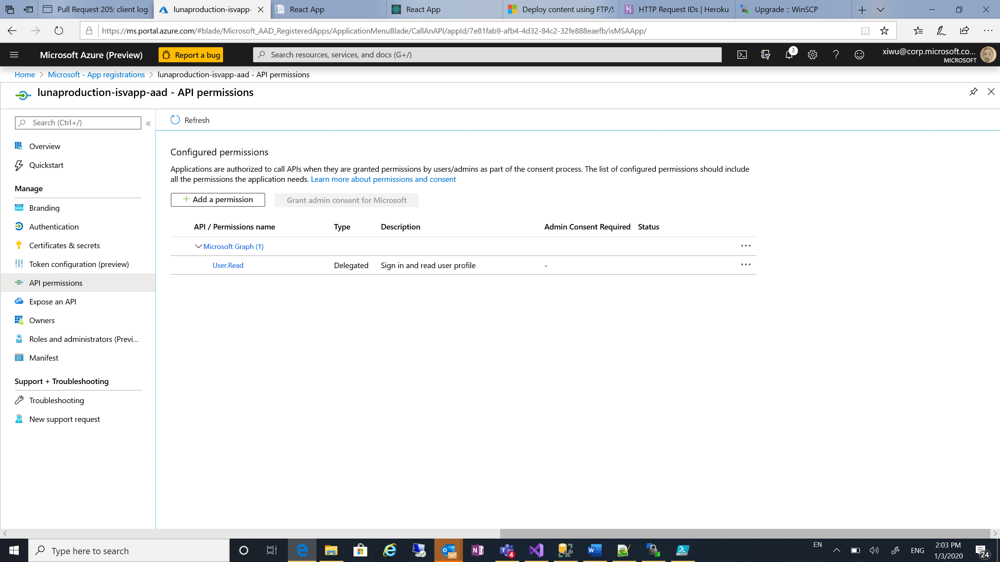

# Deploy Luna Service to your Azure subscription

This document shows you how to deploy Luna service to your Azure subscription.

## Using a PowerShell Script

The most convenient way to deploy Luna service is to run the deployment PowerShell Script, which is located in .\Resource\Deployment folder.

## Prerequisites

Since Azure Active Directory PowerShell is not supported in the dotnet core version of PowerShell yet. You will need a Windows machine to deploy Luna services. If you don't have a windows machine, you can create a Windows VM in Azure.

You will need to be owner or contributor to the subscriptions. There will be two subscriptions being used: one for all Azure resources running Luna service, another one to deploy user application after your offer is created. They can be same or different subscriptions.

You will need access to your organization’s Azure Active Directory and register AAD application.

Follow the “Environment Setup” to setup your local environment.

Azure Resource Provider for the following Azure services need to be registered in your subscription:

+ Azure App Service
+ Azure SQL Database
+ Azure Key Vault
+ Azure Storage
+ Azure Application Insights
  
## Environment Setup

1. Clone the GitHub repo
2. Install the latest .net framework from [here](https://dotnet.microsoft.com/download/dotnet-framework)
1. Install Windows PowerShell following this [instructions](https://docs.microsoft.com/en-us/powershell/scripting/install/installing-windows-powershell?view=powershell-6).
1. Start a Windows PowerShell window as administrator and run the following commands to install Azure and Azure AD modules:

```bash
Install-Module -Name Az -AllowClobber

Install-Module -Name AzureAD -AllowClobber

Install-Module -Name sqlserver -AllowClobber
```
4. Set the priorities running ```Set-ExecutionPolicy -Scope Process -ExecutionPolicy Bypass```. Choose  ```"A"```, to change the policy to **Yes to All**. If you get a permission error, you can try:

     1. Run the PowerShell terminal as an Administrator
     1. Set the priorities running ```Set-ExecutionPolicy -ExecutionPolicy unrestricted```.
     
## Deployment

You will run the **./deploy.ps1** script file in the deployment folder. The following parameters are required:

| Name | Type | Description | Notes |
|:-----|:-----|:------------|:------|
-uniqueName | string | A unique name which will be used as prefix of name of all Azure and AAD resources. To meet all Azure naming requirement, it has to be a string with all lower case letters and less than 12 characters. | |
-location | string | The location where all the Azure resources of Luna services will be deployed to. It must be a valid Azure location with format like “westus2”. The location must be enabled in your subscriptions.| |

The optional parameters are:
| Name | Type | Default Value | Description | Notes |
|:-----|:-----|:--------------|:------------|:------|
| tenantId | string | The default tenant | The tenant id for Azure subscriptions and Azure Active Directory | |
| accountId | string | The current user name | The account id of current user. | |
| lunaServiceSubscriptionId | Guid | The default subscription for AAD account you used to sign in. | The subscription where all Azure resources for Luna services will be deployed to. | |
| userApplicationSubscriptionId | Guid | The value of lunaServiceSubscriptionId | The subscription where all Azure resources for user applications will be deployed to after your offer is published. This setup will grant “contributor” role to the Luna service so we can deploy ARM templates to this subscription. | |
| resourceGroupName | string | $uniqueName + “-rg” | The name of the resource group where all Azure resources for Luna services will be deployed to. | |
| keyVaultName | string | $uniqueName + “-keyvault” | The name of Azure Key Vault | |
| sqlServerName | string | $uniqueName + “-sqlserver” | The name of the Azure SQL Server | |
| sqlDatabaseName | string | $uniqueName + “-sqldb” | The name of the Azure SQL Database | |
| StorageName | string | $uniqueName+”storage” | The name of the Azure Storage account. Note there’s no “-“ in the name since Azure Storage doesn’t allow “-“ in the account name. | |
| appServicePlanName | string | $uniqueName + “-appsvrplan“ | The name of the App Service plan | |
| isvWebAppName | string | $uniqueName+”-isvapp” | The name of the Web App service for ISV management website. It will also be a part of the url of the website. | |
| enduserWebAppName | string | $uniqueName + “-userapp” | The name of the Web App service for end user subscription management website. It will also be used as a part of the url of the website. | |
| apiWebAppName | string | $uniqueName + “-apiapp” | The name of the Web App service for the backend APIs.  | |
| apiWebJobName | string | $uniqueName + “-apiwebjob” | The name of the WebJob. It will be deployed as a part of the backend API web app. | |
| apiWebAppInsightsName | string | $uniqueName + “-apiappinsights” | The name of the Application Insights for the API web app. | |
| azureMarketplaceAADApplicationName | string | $uniqueName+”-azuremarketplace-aad” | The name of the AAD application for Azure Marketplace authentication. If  azureMarketplaceApplicationId is provided and the application already exists, the name will be ignored.  | |
| azureMarketplaceAADApplicationId | guid | Empty guid | The id of the AAD application for Azure Marketplace authentication. If not specified, a new AAD application will be created | |
| azureResourceManagerAADApplicationName | string | $uniqueName+”-azureresourcemanager-aad” | The name of the AAD application for Azure Resource Manager authentication. If  azureResourceManagerApplicationId is provided and the application already exists, the name will be ignored.  | |
| azureResourceManagerAADApplicationId | guid | Empty guid | The id of the AAD application for Azure Resource Manager authentication. If not specified, a new AAD application will be created | |
| webAppAADApplicationName | string | $uniqueName+”-apiapp-aad” | The name of the AAD application for backend API authentication. If  azureResourceManagerApplicationId is provided and the application already exists, the name will be ignored.  | |
| webAppAADApplicationId | guid | Empty guid | The id of the AAD application for backend API authentication. If not specified, a new AAD application will be created | |
| sqlServerAdminUsername | string | cloudsa | The admin username for the Azure SQL Server.  | |
| keyExpirationByMonth | int | 12 | The length of the expiration for AAD client secret. | |
| firewallStartIpAddress | string | the client ip | The start ip address for Azure SQL Server. You only need to specify this if you are connecting using any kind of VPN or proxy.  | |
| firewallEndIpAddress | string | the client ip | The end ip address for Azure SQL Server. You only need to specify this if you are connecting using any kind of VPN or proxy. | |
| buildLocation | string | The build location for latest release | Where the Web App services bits will be copied from. You only need to specify this if you are deploying a customized build. | |
| companyName | string | Microsoft | The company name which will be shown on the title of the ISV and end user website | |
| adminTenantId | string | common | The tenant id of admin for ISV management website. If not specified, AAD user from any tenant can access the website. To protect the ISV management website, at least one of the following parameters need to be specified: **adminTenantId** and/or **adminAccounts**
| adminAccounts | string | Empty | The admin accounts separated by “;”. If not specified, all AAD users from the specified tenant can access the ISV management website. To protect the ISV management website, at least one of the following parameters need to be specified: **adminTenantId** and/or **adminAccounts**

## Deployment Examples

Please use the examples below as a reference.

### Deploy using all default parameters

```bash
.\Deploy.ps1 -uniqueName lunasample -location westus2
```

### Deploy Luna services to a specific subscription

```bash
.\Deploy.ps1 -uniqueName lunasample -location westus2
-lunaServiceSubscriptionId a6c2bcaa-d67e-4a1a-b765-983f08c0423a
```

### Deploy Luna service with specific web app name

```bash
.\Deploy.ps1 -uniqueName lunasample -location westus2 -apiWebAppName lunaapi -enduserWebAppName lunaenduser -isvWebAppName lunaisv
```

### Deploy Luna service with a specific AAD application

```bash
.\Deploy.ps1 -uniqueName lunasample -location westus2 -azureMarketplaceAADApplicationId 2dca86fb-befb-412f-9177-4702cce3db73
```

## Sign into you Azure account

After the script starts running, you will need to sign in your Azure account and Azure Active Directory account.

## Running the deployment

The deployment script will perform the following steps:

1. Create resource group and deploy Azure resources using ARM template
   1. Azure Key Vault
   2. Azure SQL Database
   3. Azure Storage
   4. Azure Web App
      1. ISV UI service
      2. End user UI service
      3. Backend API service
   5. Azure Application Insights
2. Create Azure Active Directory applications and store application secretes to key vault
3. Create service principal and role assignment to grant permission to the deploy user application to the subscription
4. Grant key vault access to Azure web apps
5. Create firewall rules on Azure SQL Server
6. Run SQL script to create user and tables
7. Store storage account key and SQL connection string to key vault
8. Update application settings for Azure web app
9. Create web job

## After the deployment

After the auto deployment, there’re few tasks you may want to do:

+ Reset the admin password for Azure SQL Server. We created a random password during the deployment and didn’t record it anywhere. You will need to reset the password if you want to use the admin account.

+ Add SQL Server firewall rule for local debug. We added the firewall rule for the client ip.

+ Rotate the keys and update the secrets in key vault. Rotate all the keys and secrets according to your organization’s security policy. Don’t forget to update the secrets stored in Azure Key Vault after key rotation. Otherwise, the Luna service will stop working.

## Manual Deployment

If you want to reuse existing resources or customize the deployment, you can choose to deploy the service manually.

## Create Azure Resources

### Azure Key Vault

In Luna services, we store and protect all secrets in Azure key vault. You can use an existing key vault or create a new one. For more information about how to create key vault and how to store the secrets, please see the [Azure Key Vault documentation](https://docs.microsoft.com/en-us/azure/key-vault/vs-secure-secret-appsettings).

Later when Azure web app service instance are created, we also need to grand key vault access to the web apps. We will cover it in the later section. You can learn the end to end workflow from this tutorial.

### Azure SQL Database

In Luna services, we store all the service metadata in an Azure SQL database. We highly recommend you use a dedicated database. The database can be created in an existing server or a new server.  

The “Allow Azure services and resources to access this server” option must be turned on in the Azure SQL Server. We recommend General Purpose with 2 vCore or S3 as minimum SLO for the Azure SQL Database.

After the database is created, you need to run deploySQL.sql script in the deployment folder to create required table. A user with database owner role will be created in the script. You can also create your own login and user if your organization has specific database security requirement.

The ADO.NET connection string with SQL authentication need to be stored in the key vault as secrets with name “connection-string”. You can get the connection string in the database blade in Azure Portal under “Settings -> Connection string”.

### Azure Storage Account

In Luna services, we store all the ARM templates in an Azure storage account. We recommend you use a dedicated storage account. After the storage account is created, you need to store the storage account key to the key vault as a secret with name “storage-key”.

### Azure Web App service and Application Insights

Luna services will need 3 Azure Web App services to host the backend API service, ISV UI app and end user UI app. The 3 web app services can be in the same app service plan.  

The backend API web runs on .netcore 3.0. We recommend you enable Application Insights to track all services logs and exceptions. The 2 UI apps can be running on any stack.  

After the app services are created, you can deploy the bits using FTP/S. The deployment packages can be found at “”. To learn more about deploy using FTP/S, please see the [online documentation](https://docs.microsoft.com/en-us/azure/app-service/deploy-ftp).

### WebJob

Luna services use a web job to manage all subscription operations. The web job must be deployed in the backend API web app. You can create the web job on the app service blade in Azure Portal under “Settings -> Webjobs” using the following parameters:

+ Name: any name
+ File upload: you can find the package at “”
+ Type: Triggered
+ Triggers: Scheduled
+ CRON Expression: We recommend you run the webjob every minute with CRON expression of “0 * * * * *”. You can also use a different frequency according to your business volume.

### Create AAD applications

AAD authentication is integrated in Luna services for user sign-in and service to service authentication. To deploy and run Luna services, you need to created five AAD applications:

| Description | Supported account type | Client secret | Secret name | Notes |
|:------------|:-----------------------|:--------------|:------------|:------|
| For Azure Marketplace | Single tenant | Required | amp-app-key | |
| For Azure Resource Manager | Single tenant | Required | arm-app-key | |
| For web app and web api authentication | multi tenant | Required | api-app-key | |

For all AAD applications, you need to grant User.Read permission on Microsoft Graph to the application. You can do it on the AAD application blade under “Manage -> API permission”.



For each AAD application, you will need to record the following information:

+ Application ID, also can be referred to as client ID
+ Directory ID, also can be referred to as tenant ID
+ Client secret, also can be referred to as application password

All the client secrets should be stored in the Azure key vault created in the previous step with the corresponding secret name.

### Grant permission to AAD application to access Azure subscription

The AAD application for Azure Resource Manager (ARM) will be used to create and manage Azure resources when end user create, update or delete the application. You need to assign the subscription contributor role to the AAD application for Azure Resource Manager. For more information about how to add a role assignment, please see [Azure Role-based access control documentation](https://docs.microsoft.com/en-us/azure/role-based-access-control/role-assignments-portal).

### Grant key vault access to Web Apps

The web apps will need to access Azure key vault to read the secrets. You need to do it for all three web apps. You can find the tutorial of enabling a managed identity in Azure web app and assign permission in Azure key vault [here](https://docs.microsoft.com/en-us/azure/key-vault/tutorial-net-create-vault-azure-web-app#enable-a-managed-identity).

To protect your secrets, you only need to grant **List** and **Get** permission on secrets to the web apps. The web apps don’t need any permission on key or certificates.

### Update Application Settings

After all deployment finished, the app services need to know which database to connect to and which key vault to get secrets from. For the backend API service, you can provide all information by updating the application settings. For the UI service, since they are REACT applications, we need to do a little trick to update the settings.

### For backend API app

You can update the application settings in the app service blade under “Settings -> Configuration”. The following settings need to be updated:

| Name | Value |
|:-----|:------|
| SecuredCredentials:VaultName | The name of key vault where the SQL connection string (connection-string) and storage account key (storage-key) are stored|
| SecuredCredentials:StorageAccount:AccountName | The storage account name |
| SecuredCredentials:Database:DatabaseName | The Azure SQL database name |
| SecuredCredentials:ResourceManager:AzureActiveDirectory:VaultName | The key vault where the Azure Resource Manager AAD application secret (arm-app-key) is stored |
| SecuredCredentials:ResourceManager:AzureActiveDirectory:ClientId | The client id of the Azure Resource Manager AAD application |
| SecuredCredentials:ResourceManager:AzureActiveDirectory:TenantId | The tenant id of the Azure Resource Manager AAD application |
| SecuredCredentials:Marketplace:AzureActiveDirectory:VaultName | The key vault where the Azure Marketplace AAD application secret (amp-app-key) is stored |
| SecuredCredentials:Marketplace:AzureActiveDirectory:ClientId | The client id of the Azure Marketplace AAD application |
| SecuredCredentials:Marketplace:AzureActiveDirectory:TenantId | The tenant id of the Azure Marketplace AAD application |
| WebJob:APIServiceUrl | The URL of the API web service. It will be used by the webjobs |

For end user UI web app

You need to [connect to the file system using FTP/S](https://docs.microsoft.com/en-us/azure/app-service/deploy-ftp) and find a file named “config.js” under site/wwwroot directory. You will update the content with following values:

```json
var Configs = {
    API_ENDPOINT: "https://<backend_api_app_name>.azurewebsites.net/api/",
    ISV_NAME: "<your_org_or_application_name>",
    AAD_APPID: "<the_client_id >",
    AAD_ENDPOINT: "https://<user_ui_app_name>.azurewebsites.net"
}
```

| Name | Value |
|:-----|:------|
| backend_api_app_name | The name of the backend API web app |
| your_org_or_application_name | Name of your organization or application. It will show as title of the webpage |
| the_client_id | The client id of the AAD application for web app authentication |
| user_ui_app_name | The name of the end user UI web app |

For ISV UI web app

You need to [connect to the file system using FTP/S](https://docs.microsoft.com/en-us/azure/app-service/deploy-ftp) and find a file named “config.js” under site/wwwroot directory. You will update the content with following values:

```json
var Configs = {
    API_ENDPOINT: "https://<backend_api_app_name>.azurewebsites.net/api/",
    ISV_NAME: "<your_org_or_application_name>",
    AAD_APPID: "<the_client_id >",
    AAD_ENDPOINT: "https://<isv_ui_app_name>.azurewebsites.net"
}
```

| Name | Value |
|:-----|:------|
| backend_api_app_name | The name of the backend API web app |
| your_org_or_application_name | Name of your organization or application. It will show as title of the webpage |
| the_client_id | The client id of the AAD application for web app authentication |
| isv_ui_app_name | The name of the ISV UI web app |
