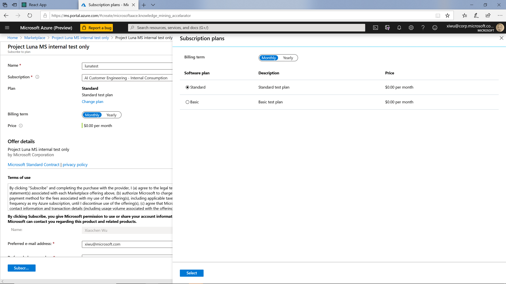
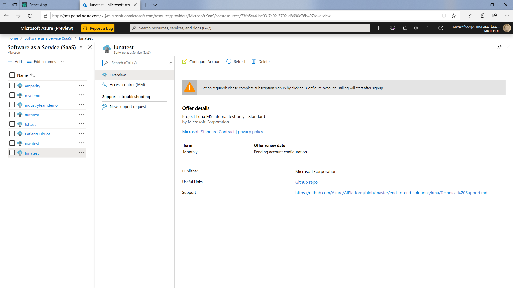
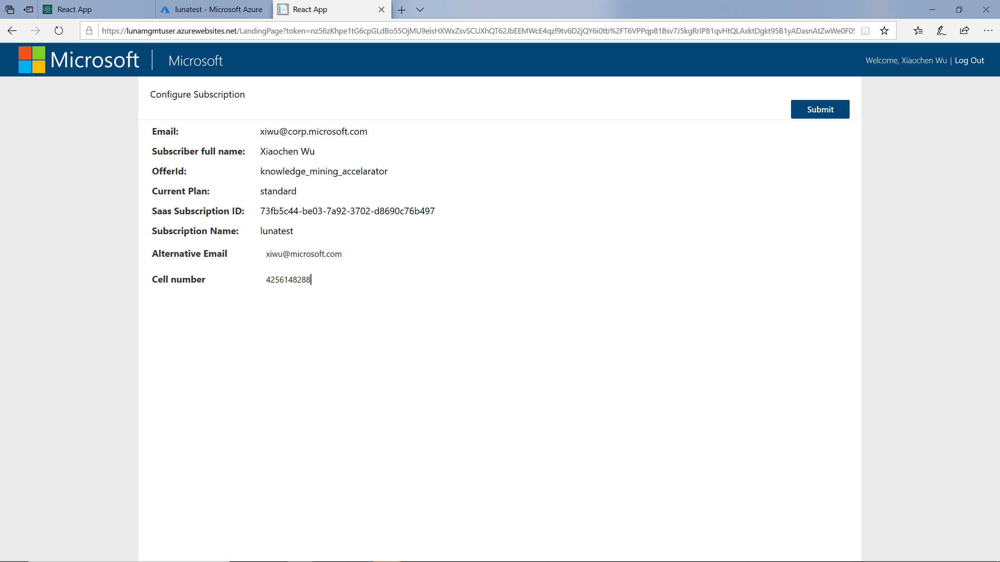
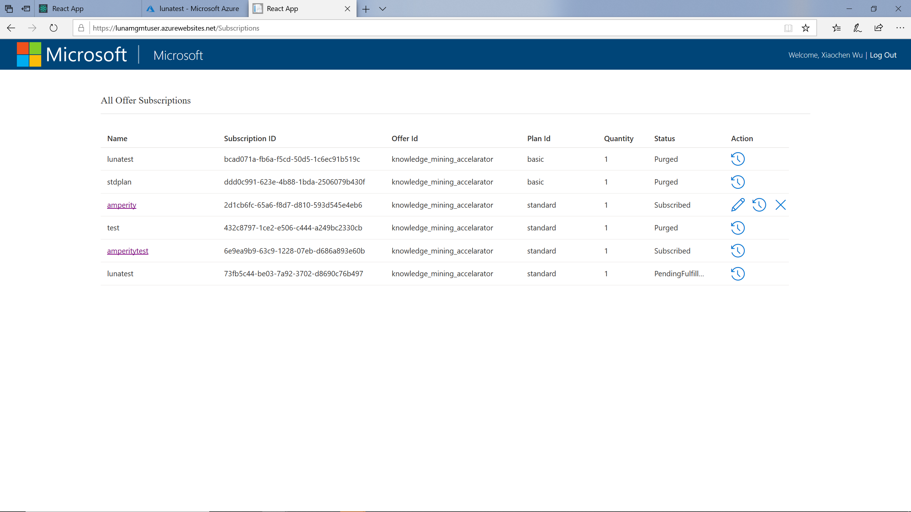

# Luna end user experience
Project Luna provides a built-in end user portal, including a landing page and a subscription management page. In this document, we will introduce the end to end customer experience provided by Luna.

## User subscribe the application
### Subscribe in Azure Portal
After the user login into the Azure portal, they can find the SaaS offer by go to All Services -> Software as a Service (SaaS). By clicking on Add button, they will be brought to the Marketplace page, where they can search for your application.

To create the application, they need to specify a name, pick the subscription and choose the plan. After click on the “subscribe” button, the subscription will be registered in Azure Marketplace. 

Back to the Software as a Service (SaaS) list, the user will see the subscription is created with status “Action required: Configure Account”. Clicking on the subscription name and opening the resource page, the user can click on the “Configure Account” button to open the subscription landing page, which is created by Luna.

### User landing page
On the landing page, the user will see the basic information about the subscription. The user also can provide more information (defined as offer parameters when creating the offer in Luna) according to the offer configuration. After click on the “Submit” button, the request will be sent to the Luna service and trigger the provisioning workflow, and the user will be redirected to the subscription management page.

### Manage subscriptions
On the subscription management page, user can see all the subscriptions they owned. They can also update the plan of an active subscription or delete it. If the entryPointUrl parameter is provided when configuring the offer, the user can click on the link on the subscription name to access the user portal provided by the ISV. 

## Next Steps:
- [ISV manages all user subscriptions](manage_user_subscriptions.md)