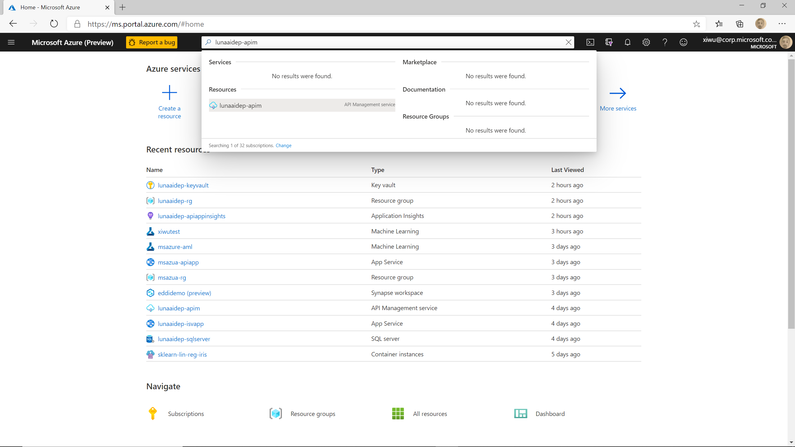
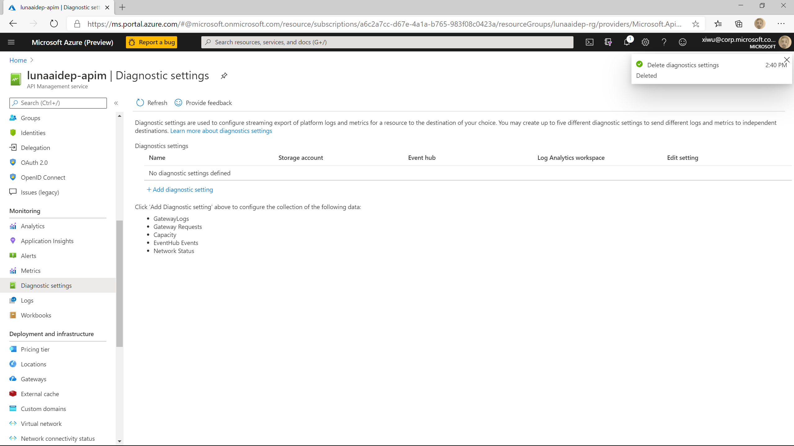
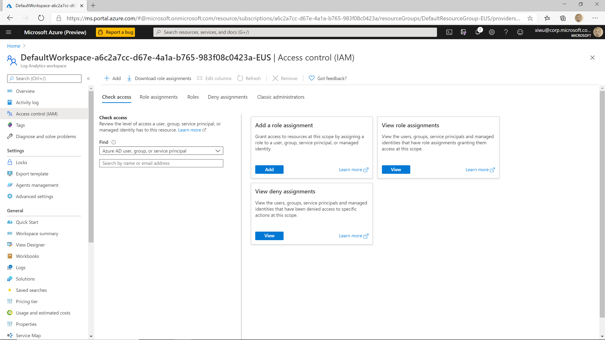
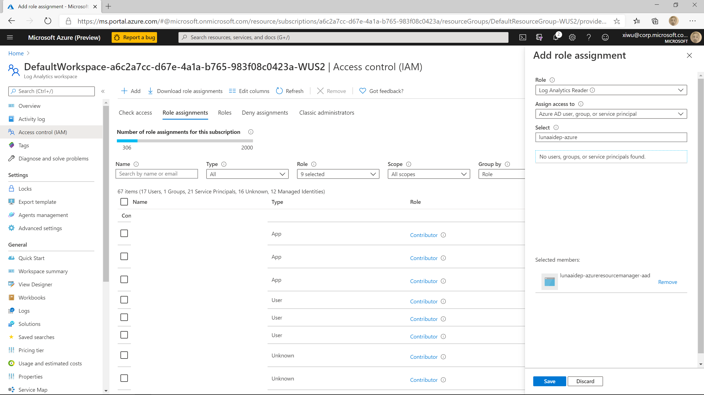
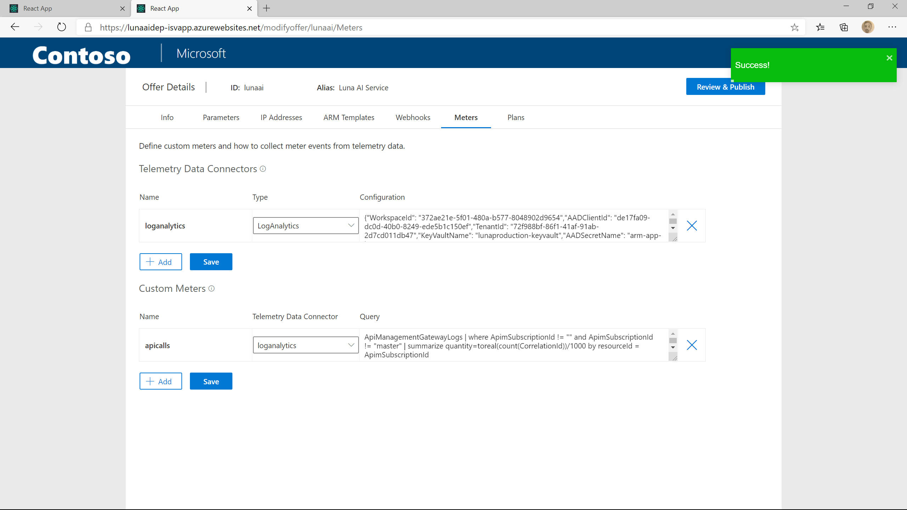

# Configure usage based billing

In this article, we are going to show you how to configure usage based billing in Luna service for your SaaS offer.

When we created the SaaS offer in Azure Marketplace, we configured the a meter to bill the user $0 per 1000 API calls. We are going to continue to use this meter to configure usage based billing.

In Luna service, we assume all the billing events can be generated by aggregating the telemetry data. In this sample, we will collect the API management gateway log into Azure Log Analytics and configure Luna service to query the telemetry data, generate and send the billing events.

## Create a Log Analytics workspace

You can following [this instruction](https://docs.microsoft.com/en-us/azure/azure-monitor/learn/quick-create-workspace) to create a Log Analytics workspace.

## Collect API management Telemetry data

After the Log Analytics workspace is created, we need to configure the API management service to send the telemetry data to the Log Analytics workspace.

First login into Azure portal, type in uniqueName-apim in the search textbox and select the service.



On the APIM resource page, select "Diagnostic settings" under "Monitoring" in the menu on the left side.



Click on "Add diagnostic setting" on the page. It will open the diagnostic setting details page. On this page, give the setting a name, check at least "GatewayLogs" under "log", and check "Send to Log Analytics" under "Destination details". Then select the Log Analytics workspace you just created and click on "Save" button.

Now API Management service will start to send telemetry data in the categories you checked to your Log Analytics workspace.

## Configure access to Log Analytics workspace

Now we need to configure the access to Log Analytics workspace from Luna service.

- Go back to the Log Analytics workspace in Azure portal by type in the name in the search text box. Select "Access Control" in the menu on the left side.

    

- Click on "Add" button and choose "Add role assignement"
- On the popped up side window, choose "Log Analytics Reader" as role and in the "Select" text box, type in "uniqueName-AzureResourceManager-aad" where uniqueName is the unique name you used when deploying Luna service. Choosed the filtered item and click on "Save". Here in this example, we are reusing the AAD application we created for Luna service to deploy ARM templates to your Azure subscription. If you want to create a new AAD application for this purpose, you can follow the instruction [here](https://docs.microsoft.com/en-us/azure/active-directory/develop/howto-create-service-principal-portal).

    

- Go back to the overview page of the workspace and write down the Workspace ID

## Configure custom meter in Luna management portal

Login into the Luna management portal and click on the little pencil button on your offer to open the offer configuration wizard. Then go to the Meter tab.

Click the "+ Add" button under telemetry data connectors" to add a new entry. Give it a name, choose "LogAnalytics" as type and put the following JSON string in the "Configuration" text field:

```json
{
    "WorkspaceId": "workspace-id",
    "AADClientId": "aad-client-id",
    "TenantId": "aad-tenant-id",
    "KeyVaultName": "uniqueName-keyvault",
    "AADSecretName": "arm-app-key"
}
```

where workspace_id is the one your just saved in the previous step. If you are reusing the AAD application in the previous step, the aad-client-id and aad-tenant-id is the ones you got when your are [registering AML workspace](./publish-ai-service.md#Register-a-Azure-Machine-Learning-workspace) in a previous step, and the uniqueName is the unique name you used when you were deploying Luna service. Otherwise, you need to get the client id, tenant id from the new created AAD application, save the client secret in the key vault and update the AADSecretName as well.

Then you can click on save to save the update. This will tell Luna service how to connect to your Log Analytics workspace.

Click on "+ Add" button under "Custom Meters" to add a new entry. The meter name here has to be the same with the meter name you used when configuring the plan in the Azure Marketplace SaaS offer (TODO: add link). Choose the telemetry data connector you just created in the dropdown list, put the following Log Analytics query in the "Query" text box and click on "Save" button to save the changes.

```text
ApiManagementGatewayLogs
| where ApimSubscriptionId != "" and ApimSubscriptionId  != "master"
| summarize quantity=toreal(count(CorrelationId))/1000 by resourceId = ApimSubscriptionId
```



## Update plan to use the custom meter

Now you need to tell Luna service which plan is using this custom meter.

Go to the "Plan" tab and click on the pencil button on your plan to open the "Modify Plan" window. In the pop up window, click on the "+ Add" button under "Custom Meters", choose the meter you just created and click on "Save".

Now Luna service will automatically run the telemetry query against the Log Analytics workspace, aggregate the result and send it to Azure Marketplace as meter events.

## Next Step

[Deploy and publish a hotfix](./deploy-a-hotfix.md)
