# Publish an AI service

In this article, we will show you how to publish an AI service using Luna management portal using the service endpoint and AML pipelines we published in the previous steps.

## Access Luna management portal

You can access the Luna management portal at https://*uniqueName*-isvapp.azurewebsites.net/ where *uniqueName* is the unique name you picked when you deploying Luna service. You will need to log in the portal using you AAD account. The AAD account must be added as the admin account during the deployment.

## Publish a real time prediction service

A real time prediction service allows the end user to call the endpoint API for real time scoring using a pre-trained model. In this example, we will use the Logistic Regression model we trained earlier using the Iris sample data.

You can skip this section if you are not planning to publish a real time prediction service.

### Create a real-time prediction product

You can create a new AI product by click on the "New Product" button on the "Products" tab. You will need to provide the following information:

- Id: the product id. In this example, we are going to use rtp_product
- Product Type: the type of the product, choose Real-time Prediction
- Host Type: choose SaaS. "Bring Your Own Compute" host type is not supported yet.
- Owner: use your AAD id

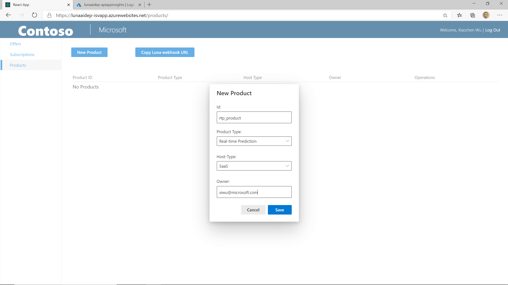

Then click on "Save" button to save the changes.

### Create a real-time prediction deployment

After the product is created, you will see two sections on the "Product Details" page: Deployments and AML Workspaces. For a real-time prediction AI service, you don't need to register an AML workspace yet. We will cover that in the next section when creating the train your own model service.

To create a new deployment, click on the "New Deployment" button. You will need to provide the following information:

- Deployment Name: the name of the deployment. We are going to use *rtp_deployment* in this example.
- Description: the description of the deployment, you can write your own description here

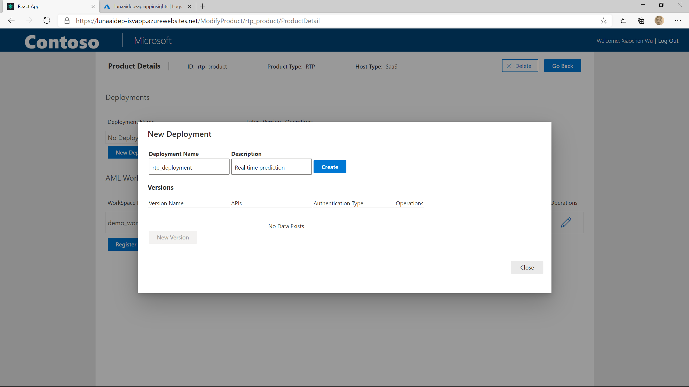

Then click on "Create" button to save the changes.

### Create a real-time prediction API version

In Luna AI service, we allow you to create multiple version of APIs for a deployment. To create a new API version, click on the "New Version" button.

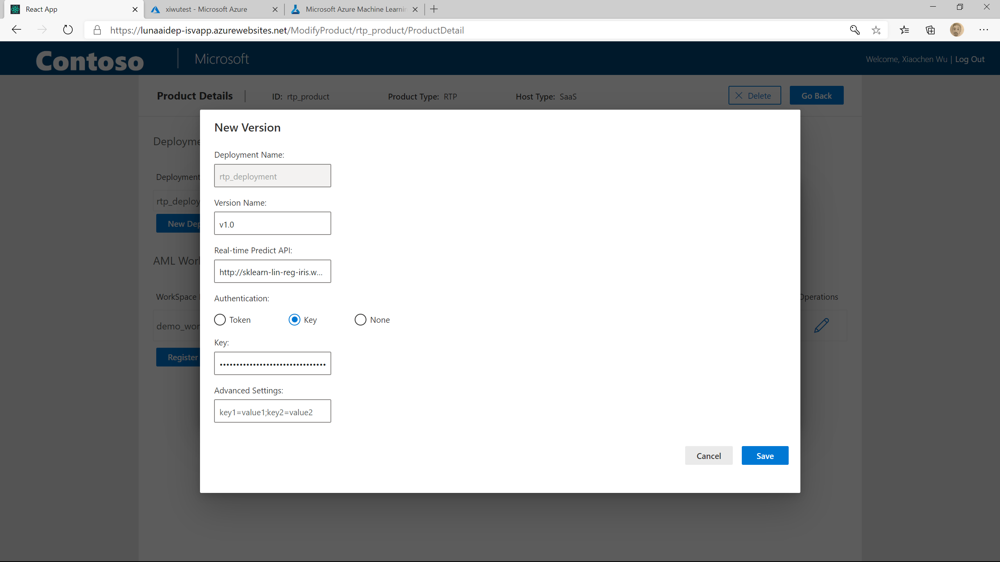

## Publish a train-your-own-model AI service

A train-your-own-model AI service allows the end user to call the APIs to train models using their own data, do batch inference with their own models and/or deploy the models to real time service endpoint for their online applications.

You can skip this section if you are not planning to publish a train-your-own-model AI service.

### Create a train-your-own-model product

We are going to create a new product with name tyom_product for the train your own model AI service. For "Product Type", you should choose "Train Your Own Model"

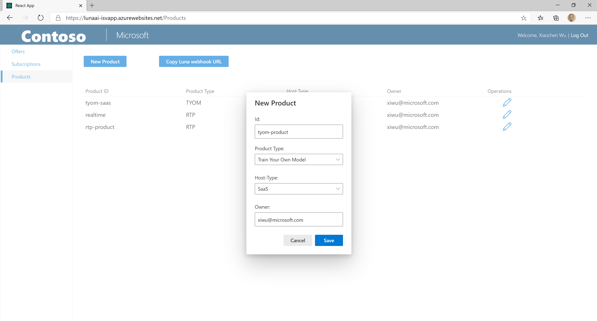

Then click on the "Save" button to save the changes.

### Register a Azure Machine Learning workspace

In a "Train Your Own Model" AI service, the model training, batch inference and deployment are running in an Azure Machine Learning workspace as pipeline runs. We already published the AML pipelines in the previous step (TODO: add link). To create the AI service, you need to provide the information about your Azure Machine Learning workspace and how to connect to it.

In Luna service, we use an AAD application to connect to the Azure Machine Learning service. In this example, we will reuse an AAD application we created when deploying Luna service.

First, in Azure portal type in "aad" in the search text box and click on "Azure Active Directory":

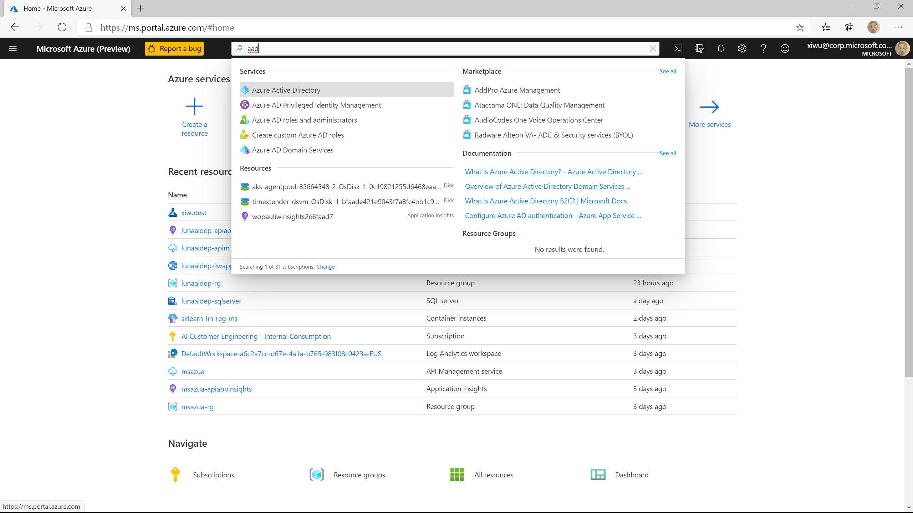

In the menu on the left side, choose "App registration". Click on "All application", type in *uniqueName*-azureresourcemanager-aad, and click on the item.

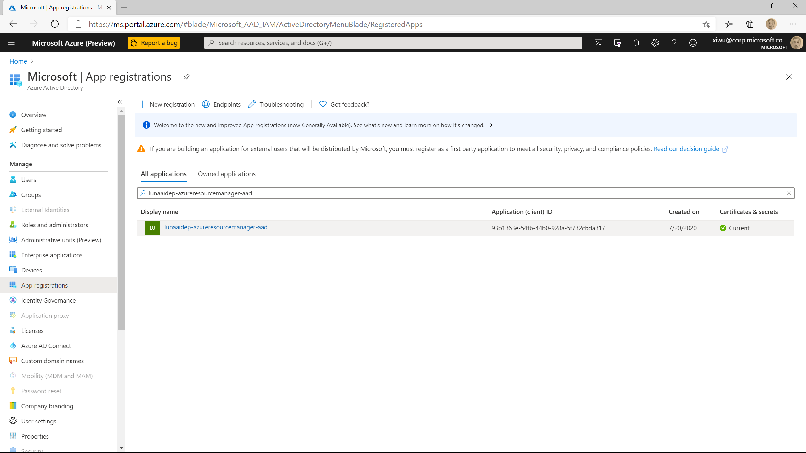

On the overview page of the AAD application, you can find the "Application (client) ID" and "Directory (tenant) ID". Write it down in the notepad

Then click on "Certificates & Secrets" in the menu on the left side. Under "Client Secrets", click on "New client secret". Write your own description and click on "Add". Copy and save the secret value before you leave the page.

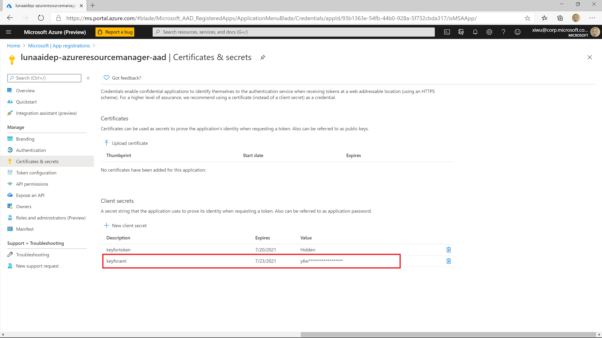

Type in the name of you Azure Machine Learning service in the search window of Azure portal, find your Azure Machine Learning service and click on it.

Click on access control

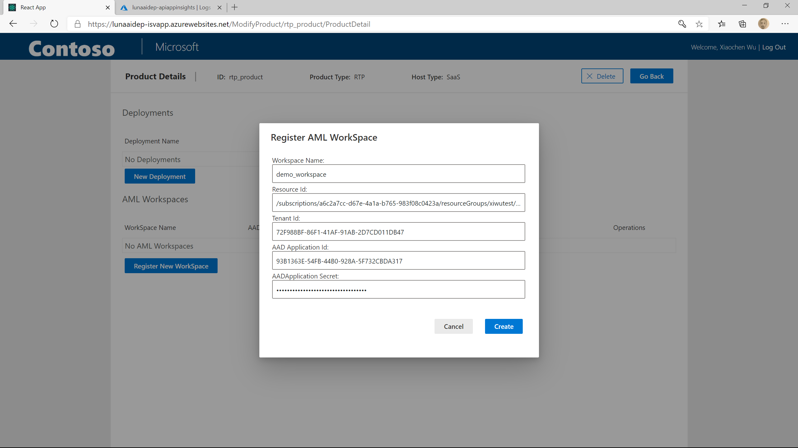

[Azure Role-based access control documentation](https://docs.microsoft.com/en-us/azure/role-based-access-control/role-assignments-portal)

### Create a train-your-own-model deployment

You can create a new deployment in your product by click on the "New Deployment" button. Put in deployment name typm_deployment, write your own description and click on "Create" button

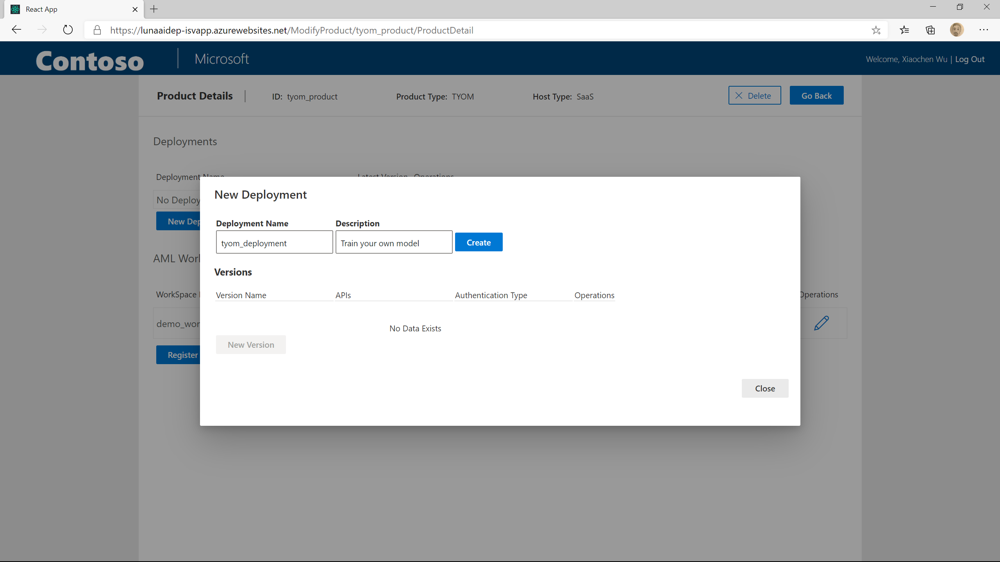

### Create a train-your-own-model API version

After the deployment is created, you can create a new API version by click on the "New Version" button. In the popped up window, put in "v1.0" as version name. TODO: finish when UI change is deployed.

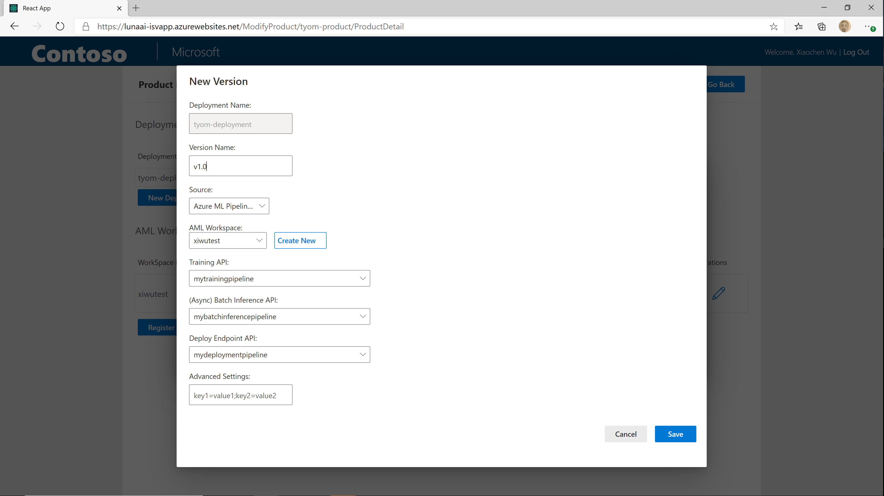

## Save the Luna webhook URL

Going back to the home page of the "Products" tab, you will see a button "Copy Luna webhook URL". Clicking on the button, it will open a modal where 3 webhook URLs are shown. Later we will use these URLs to manage subscriptions of the AI services you just published in the SaaS offer. You may want to save the URLs in a notepad so you don't have to come back to this page later.

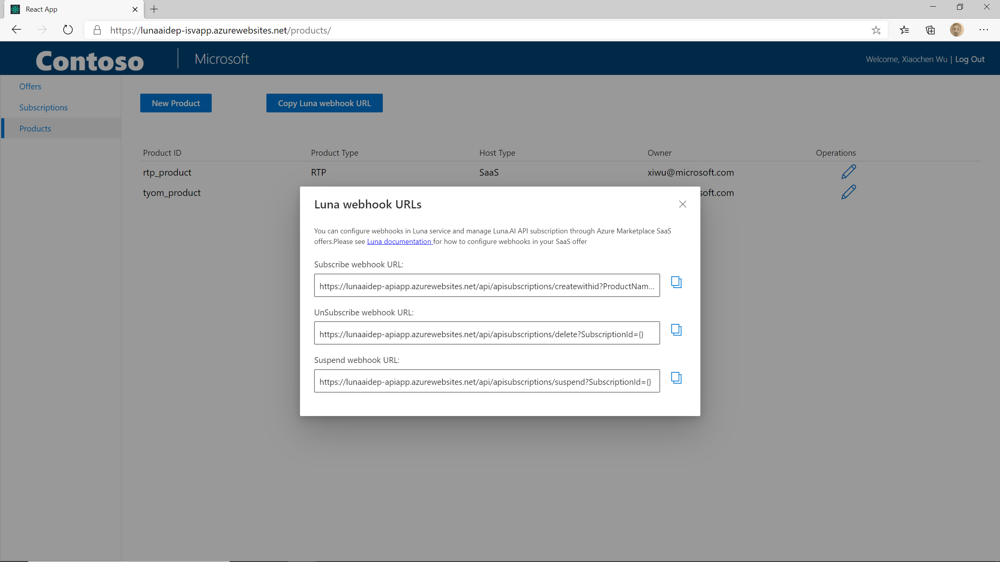

## Next Step

[Test AI service](./test-ai-service.md)
