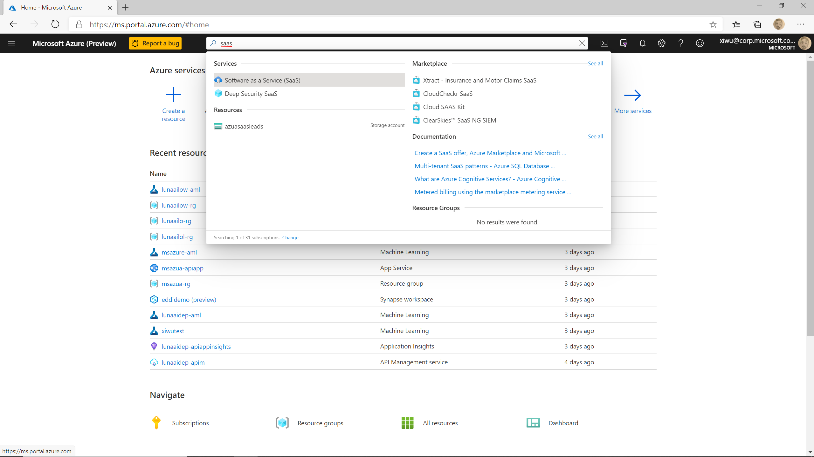
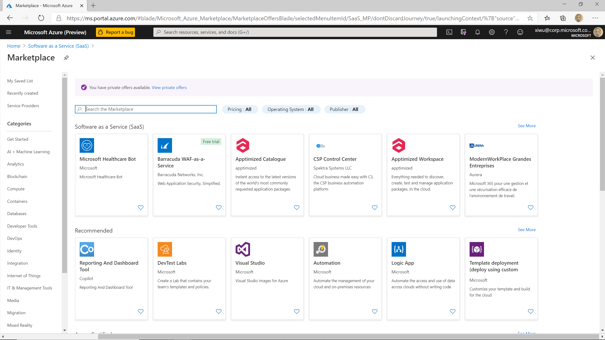
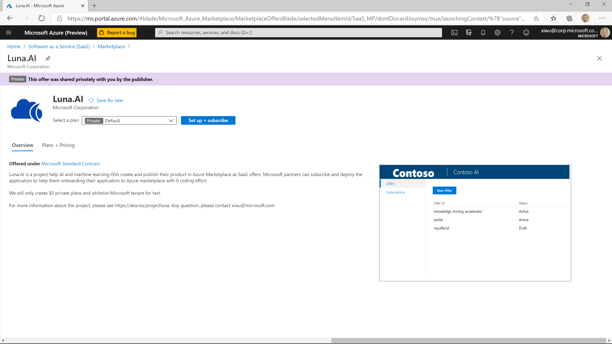
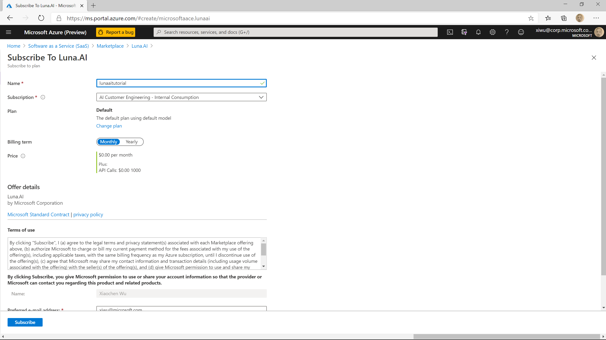
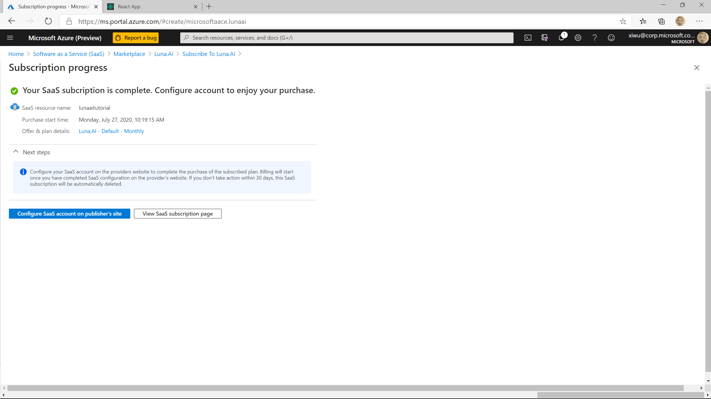
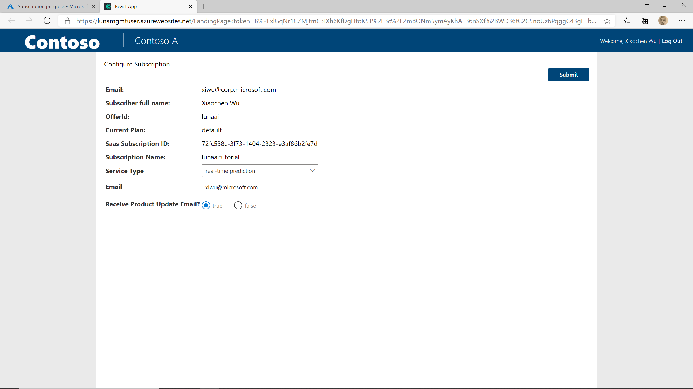
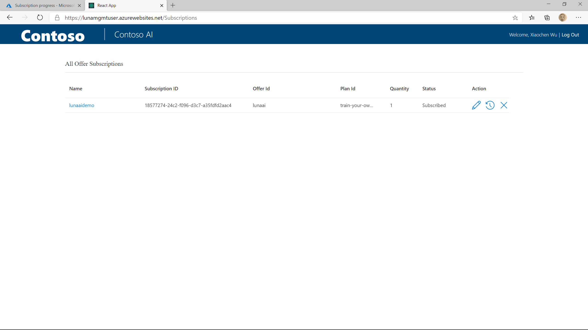

# Test the SaaS offer

In this article, we will show you how to test the SaaS offer with and without a published Azure Marketplace SaaS offer.

## Test with a published Azure Marketplace SaaS offer

If you have your Azure Marketplace SaaS offer published in the preview steps (TODO: add link). You can subscribe the SaaS offer from Azure portal.

Login into the [Azure Portal](https://portal.azure.com). Type SaaS in the search text box and choose "Software as a Service (SaaS)".



Click on the "Add" button on the upper left corner. It will bring you to the Azure Marketplace.



If you published offer with a public plan, you can search for your offer name in the search text box. If you published a private plan and whitelisted your organization's tenant id, click on the "View private offers" link on the "You have private offers available" banner to view all the private offers.

Once you find the SaaS offer you published, click on the tile. It will open the offer details page. Select the private plan you created for this tutorial and click on the "Set up + subscribe" button.



On the next page, give the subscription a name, choose the Azure subscription, and click on "Subscribe" button.



The subscription operation usaully taks 20 seconds to a minute, after the subscription completed, click on the "Configure SaaS account on publish's site". It will bring you to the landing page which is deployed and configured as a part of Luna service.



On the landing page, you will see all 3 offer parameters we created [when configuring SaaS offer in Luna management portal](./publish-saas-offer.md#add-offer-parameters).



Choose the AI service you want to test, fill in rest of the fields and click on "Submit" button. It will bring you to the user subscription management page where you can see all your subscriptions.



In the backend, Luna service started a state machine running all the provisioning steps as you configured, including calling the webhook to subscribe the AI service. The state machine runs every minute to move to the next state. it will take 3 to 5 minutes to finish the provisioning.

After the provisioning is completed (you need to refresh the page to see the changes), you should see a hyperlink on the subcription name. Click on the hyperlink, it will open a modal with the AI service base url and the subscription key.


Now you can use either the [Postman collection or the python notebook we used to test the AI service](./test-ai-service.md) to continue the test.

## Test without a published Azure Marketplace SaaS offer

Publishing a SaaS offer in Azure Marketplace requires some marketing and legal materials. We understand that could take long or collabaration with other department in your organization. Here we are going to show you how can you test the SaaS offer using REST API.

### Get AAD token

Before creating your subscription, you need to get an AAD token to be able to call the REST APIs

#### Find the AAD application info

- Login into Azure Portal, type in "AAD" in the search textbox and select "Azure Active Directory"
- In the menu on the left side, select "App Registration"
- Select "All applications", and in the search text box, type in "uniqueName-apiapp-aad" where uniqueName is the unique name you used when deploying Luna service.
- Select the filtered item.
- On the overview page, write down the "Application (client) ID" and the "Directory (tenant) ID"
- Select "Authentication" in the menu on the left side, scroll down to the bottom and select "Yes" for the "Treat application as a public client." option. Click on Save.

#### Get the AAD token

- Open a Windows PowerShell window with administrator permission
- Run *install-module -name MSAL.PS* to install the MSAL.PS module and accept all the terms. If it says you need to install the latest PowerShellGet, run *install-module -name PowerShellGet -Force* to update the PowerShellGet module first and restart the Windows PowerShell window
- Replace the uniqueName, clientId and tenantId in the following PowerShell script, and run it:

  ```powershell
  $uniqueName = "uniqueName"
  $clientId = "clientId"
  $tenantId = "tenantId"
  
  $resourceUrl = "https://graph.microsoft.com/"
  $redirectUri = "https://" + $uniqueName + "-isvapp.azurewebsites.net"
  $scopes = "api://" + $clientId + "/user_impersonation"

  $accessToken = Get-MsalToken -ClientId $clientId `
                             -RedirectUri $redirectUri `
                             -TenantId $tenantId `
                             -Scopes $scopes
  
  $accessToken.AccessToken
  ```

- copy the token. Depending on the tool you are using to run the PowerShell script, you may get linebreakers when copying the token. If that's the case, remove all the linebreakers. The valid token is a string without linebreakers.

### Create a subscirption using REST API

First, we will need to generate a new GUID as subscription id.

Then in Postman, create a new request:

```http
PUT https://uniqueName-apipp.azurewebsites.net/api/subscriptions/generated-guid
```

where *uniqueName* is the unique name you used when deploying Luna service and *generated-guid* is subscription id.

- Change the http method to PUT
- In the request URL textbox, enter "https://uniqueName-apipp.azurewebsites.net/api/subscriptions/generated-guid"
- On the "Body" tab, select "raw" and change the type to "JSON" in the dropdown list.
- Put the following JSON string into the request body text field:

  ```json
  {
    "SubscriptionId": "generated-guid",
    "Name": "subscription-name",
    "OfferName": "your-offer-name",
    "PlanName": "your-plan-name",
    "quantity": 1,
    "Owner": "your-aad-id",
    "BeneficiaryTenantId": "00000000-0000-0000-0000-000000000000",
    "PurchaserTenantId": "00000000-0000-0000-0000-000000000000",
    "InputParameters": [
        {
            "Name":"servicetype",
            "Type":"string",
            "Value":"real-time prediction"
        },
        {
            "Name":"email",
            "Type":"string",
            "Value":"your-email"
        },
        {
            "Name":"productupdate",
            "Type":"boolean",
            "Value":"true"
        }]
  }
  ```

- Update the subscription id, subscription name, offer name, plan name, owner, service type value, and your email in the request body.
- On the "Authorization" tab, select "Bearer Token" as type and add the token you got from the previous step. Make sure there's no linebreakers in the token.
- Submit the request.

In the backend, Luna service started a state machine running all the provisioning steps as you configured, including calling the webhook to subscribe the AI service. The state machine runs every minute to move to the next state. it will take 3 to 5 minutes to finish the provisioning. You can use the following request to query the provisioning status:

```http
GET https://uniqueName-apipp.azurewebsites.net/api/subscriptions/generated-guid
```

where *uniqueName* is the unique name you used when deploying Luna service and *generated-guid* is subscription id you generated in the previous step. Make sure you configured the same Bearer token on the "Authorization" tab before sending the request.

Since the offer is not published in Azure Marketplace, the provisioning will fail at the last step when trying to notify Azure Marketplace to activate the subscription. It is expected. When you see the "provisioningStatus" of the GET request is "NotificationFailed", you can continue to run the following http request to get your base url and subscription key:

```http
GET https://uniqueName-apipp.azurewebsites.net/api/apisubscriptions/generated-guid
```

Again, use the same Bearer token for authentication. You should see the baseUrl and keys in the response body. Now you can use either the [Postman collection or the python notebook we used to test the AI service](./test-ai-service.md) to continue the test.

## Next Step

[Config usage based billing](./config-meter-based-billing.md)
