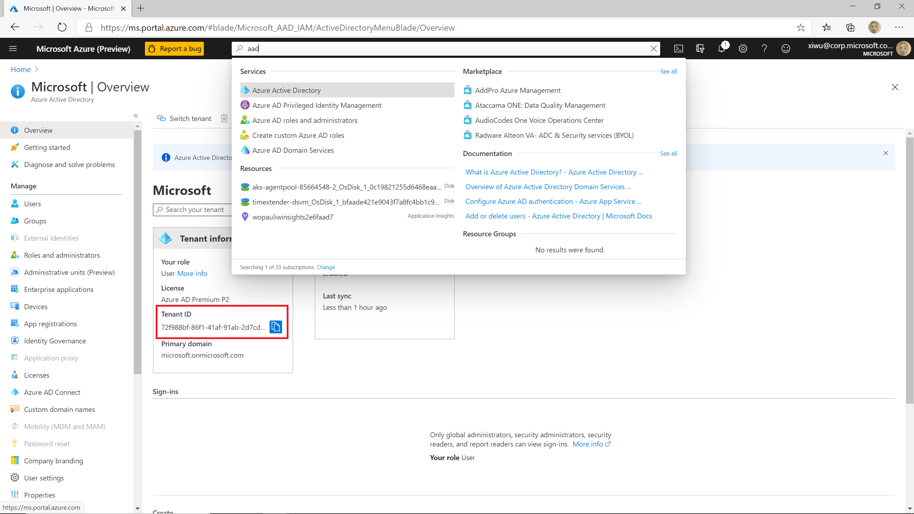
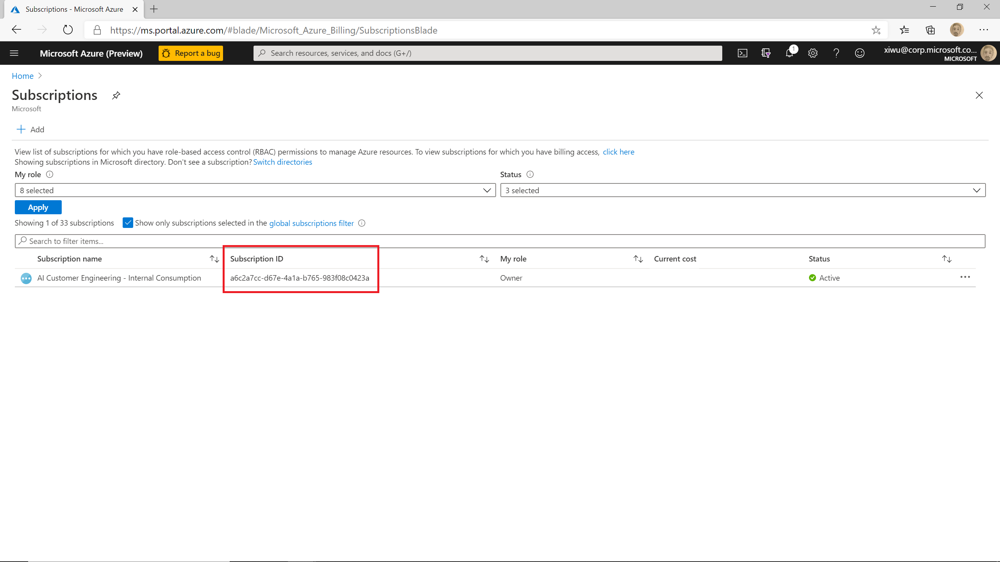
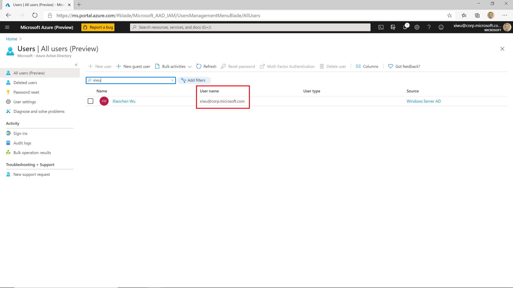

# How to find general Azure info

In this article, we will show you how to find some general information

## Where to find the tenant id

In Azure Portal, type in "aad" in the search textbox and select "Azure Active Directory". You will find the tenant id on the "Azure Active Directory" page

## Where to find the subscription id

In Azure Portal, type in "subscriptions" in the search textbox and select "Subscriptions". You will find the subscription id on this page

## Where to find your AAD user id

In Azure Portal, type in "users" in the search textbox and select "Users". Then type in your name of your alias in the "Search user" textbox, you will find your AAD user id

## How to find a valid Azure region

You can find all available Azure regions from [here](https://azure.microsoft.com/en-us/global-infrastructure/geographies/).
