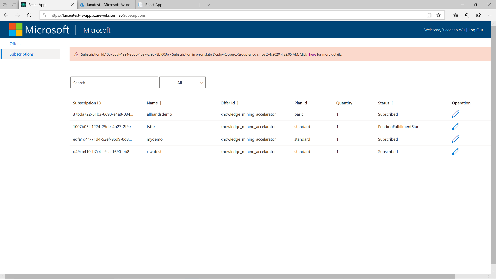
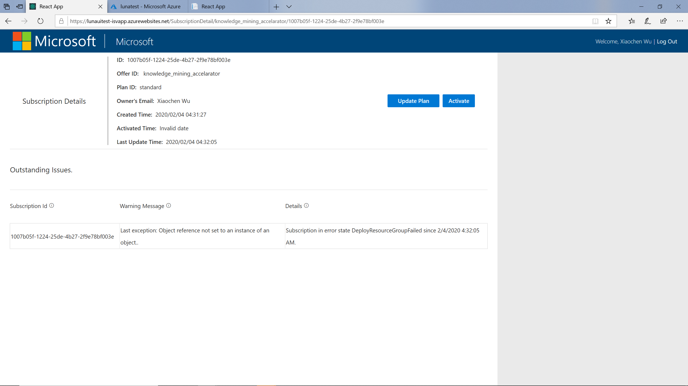

# Manage user subscriptions
Luna allows ISV to manage all user subscriptions in the ISV management portal. You can browse, troubleshoot and update user subscription. This document will show you how to manage user subscriptions using the ISV portal.

## Browse and Search user subscriptions
After login into the ISV portal, you can click on “Subscriptions” link to see all the user subscriptions. You can search the subscription by text in any field or filter them by subscription status.

If any error happened during the provisioning, for example, the ARM template deployment failed, the subscription will be in an error state. All subscriptions in error state will be shown as warnings on top of the subscription management page. You can click on the link in the warning to see more details.

## View subscription details
By clicking on the pencil button on a specific subscription, you will see a subscription details page which provides more detailed information about the subscription. If the subscription is in an error state, you can also see the latest error information. 

If a subscription is in “Subscribed” state, you can update plan of the subscription on this page on behalf of the customer. If it is in an error state, you can check the error information, manually fix the provisioning error (Luna doesn’t provide the tool to fix provisioning errors), and then click the “Activate” button to activate (for new subscription) the subscription or mark the current update or cancel operation completed (for existing subscription) in Azure Marketplace.

## Next Steps
- [Configure and manage offers](configure_and_manage_offers.md)