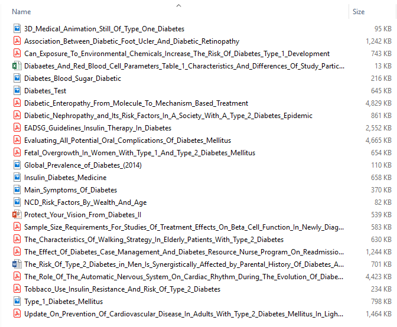
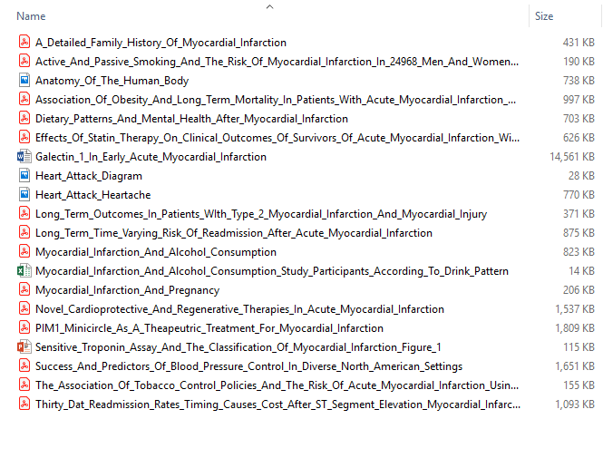
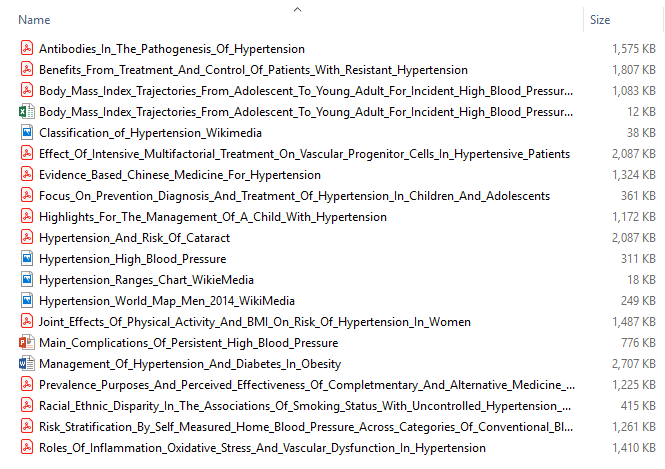
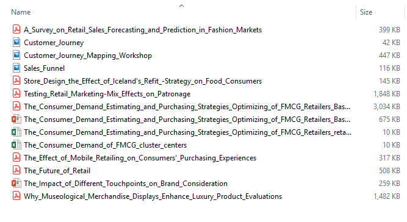

# Notice
## MICROSOFT PROVIDES THE SAMPLE DATASETS ON AN “AS IS” BASIS. MICROSOFT MAKES NO WARRANTIES, EXPRESS OR IMPLIED, GUARANTEES OR CONDITIONS WITH RESPECT TO YOUR USE OF THE DATASETS. TO THE EXTENT PERMITTED UNDER YOUR LOCAL LAW, MICROSOFT DISCLAIMS ALL LIABILITY FOR ANY DAMAGES OR LOSSES, INCLUDING DIRECT, CONSEQUENTIAL, SPECIAL, INDIRECT, INCIDENTAL OR PUNITIVE, RESULTING FROM YOUR USE OF THE DATASETS.
### This dataset is provided under the original terms that Microsoft received source data. The dataset may include data sourced from Microsoft. See below for more information.

#### Category: Healthcare
#### Topic: Diabetes
#### Files:

#### Sources:
https://journals.plos.org  
https://www.ncbi.nlm.nih.gov  
https://commons.wikimedia.org  
https://www.hindawi.com  
https://www.nei.nih.gov/diabetes  
https://www.sciencedirect.com  

#### Category: Healthcare
#### Topic: Heart Attack (Myocardial Infarction)
#### Files: 

#### Sources:
https://journals.plos.org  
https://www.ncbi.nlm.nih.gov  
https://commons.wikimedia.org  
https://www.hindawi.com  
https://www.heart.org  

#### Category: Healthcare
#### Topic: Heart Disease (Cardiovascular Disease)
#### Files: 

#### Sources:
https://journals.plos.org  
https://www.ncbi.nlm.nih.gov  
https://commons.wikimedia.org  
https://www.hindawi.com  
https://www.hearttruth.org  
https://www.elsevier.com  
https://www.heart.org  

#### Category: Healthcare
#### Topic: High Blood Pressure (Hypertension)
#### Files: 

#### Sources:
https://journals.plos.org  
https://www.ncbi.nlm.nih.gov  
https://commons.wikimedia.org  
https://www.hindawi.com  
https://www.sciencedirect.com  

#### Category: Oil & Gas
#### Topic: Downstream
#### Files: 

#### Sources:
https://www.sciencedirect.com  
https://link.springer.com  
http://www.sciencepublishinggroup.com  
https://www.omicsonline.org  

#### Category: Oil & Gas
#### Topic: Upstream
#### Files: 

#### Sources:
https://www.sciencedirect.com  
https://link.springer.com  
http://www.sciencepublishinggroup.com  
https://www.omicsonline.org  

#### Category: Retail
#### Topic: Pipeline management
#### Files: 

#### Sources:
https://www.sciencedirect.com  
https://www.jbrmr.com  
https://www.tandfonline.com  
https://www.mdpi.com  

#### Category: Retail
#### Topic: Customer Profiling
#### Files: 

#### Sources:
https://www.sciencedirect.com  
https://www.tandfonline.com  
https://commons.wikimedia.org  
https://www.altimetergroup.com  
https://journals.sagepub.com  
