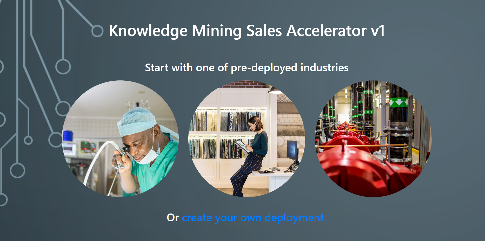
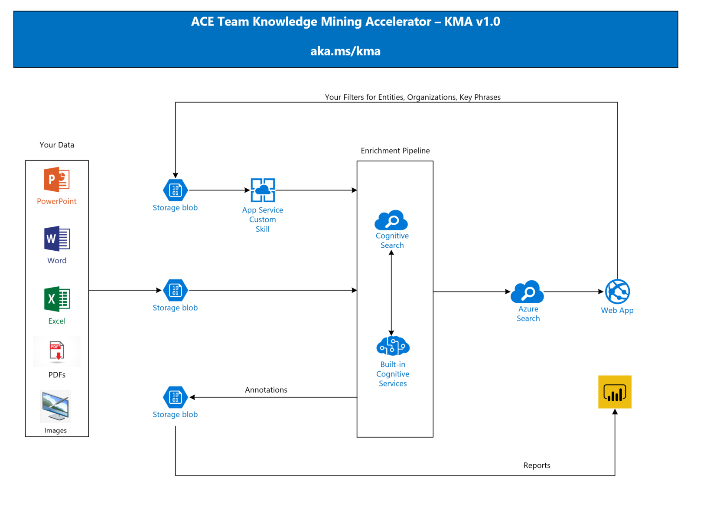

# Knowledge Mining Solution Accelerator (KMA v1.0)

We are excited to share with you the Knowledge Mining Solution Accelerator, an open source end-to-end application that enables you to quickly get up to speed and try out the latest features of Azure Cognitive Search!  

[KMA Demos Homepage](http://aka.ms/kma) | [Source Code](https://github.com/Azure/AIPlatform/tree/master/end-to-end-solutions/kma/src) | [1-Click Deployment - Bring your own data](http://aka.ms/kmadeployment)

The solution includes the most popular features of the previous Microsoft Cognitive Search demos, like [JFK](https://jfk-demo.azurewebsites.net/#/), as well as a set of new important features and capabilities - use it with your own data, customizable UI (graph visualization, colors, logos for white-labeling), facets filtering of unwanted terms, and many more (see below for a full list)!  

New features/capabilities of KMA v1.0:

+ Bring your own data: upload your files right from the web search interface and create demos or POCs in minutes  
+ Graph visualization, with customizable interface by facet  
+ Logos and layout customization. Adapt the solution for any organization you want  
+ Latest Cognitive Search updates, as Knowledge store and Complex types, for advanced analytics  
+ Modernized Web Frameworks  
+ Dynamic facet detection, with automatic web interface update  
+ Facets filtering, for unwanted terms removal. You can choose what to filter per facet  
+ Power BI dashboard
+ Suggestions while you type, for a web-search-like experience.  
+ 1-Click Deployment, a single PowerShell command  
+ Architecture Diagram Visio file, free to be shared and customized

## How to use KMA v1.0

Today we are making available three read-only pre-configured demos of KMA ([Healthcare](https://kmahc-webui.azurewebsites.net/), [Oil & Gas](https://kmaoilgas-webui.azurewebsites.net/), and [Retail](https://kmaretail-webui.azurewebsites.net/)) that can be used without any configuration and setup. Just click one of the links above and you are ready to start searching on a sample set of data relevant to these verticals!  

Figure 1: The verticals selector and the GitHub link to create your own deployment.  

Once you get familiar with the application and the capabilities of Azure Cognitive Search, you can either deploy your own version of the application and use your own data, [via a one-click deployment](https://github.com/Azure/AIPlatform/blob/master/end-to-end-solutions/kma/Deployment/readme.md), or you can get the code from our public Azure Customer Engineering (ACE) [GitHub repo](https://github.com/Azure/AIPlatform/tree/master/end-to-end-solutions/kma/src) to further customize and extent the solution to fit your own use cases/scenarios.

This [video](https://www.youtube.com/watch?v=Xp8NiljMUEI) walks you through the KMA solution and demonstrates how you can use the pre-configured versions as well as how you can deploy your own version. 

## Solution Architecture

The solution starts from any business documents the must be uploaded to blog storage. Cognitive Search will open those documents and submit its content to the enrichment pipeline, meaning that Microsoft AI Services will be used to analyze the data and create metadata about your data.

A custom skill deployed on a App Service will do all of the filtering you may want to do, removing unwanted terms from facets like key-phrases, organizations, or locations. The results are pushed into an Azure Search index and there is a web interface for data exploration.

The metadata is also stored into Azure Tables, leveraging the Cognitive Search [knowledge store](https://docs.microsoft.com/en-us/azure/search/knowledge-store-concept-intro), a brand new feature just announced on Microsoft Build 2019. It generates structured data about your unstructured content and allows you to create Power BI reports, as those ones provided with this solution.

Figure 2: The solution architecture  

## Feedback

We really appreciate your feedback! Please create issues on GitHub for any glitches that you may experience, as well as any suggestions on missing functionality. If you coded any improvement that you want to share, create a Pull Request and we will analyze your work.  

## Conclusion  

We hope that this project will be useful for anyone trying to use or demonstrate Knowledge Mining solutions. Stay tuned in this blog channel to be informed about new verticals, new features, and the lessons learned from the project development cycle. Click [here](http://aka.ms/kma) and start to using the solution, or to deploy it in your own subscription.

## Key Links  

[KMA GitHub - Direct Link](https://github.com/Azure/AIPlatform/tree/master/end-to-end-solutions/kma/src)

[ACE Team Blog](http://aka.ms/ACE-Blog)

[ACE Team - Knowledge Mining on Audio Data](https://techcommunity.microsoft.com/t5/AI-Customer-Engineering-Team/Mine-knowledge-from-audio-files-with-Microsoft-AI/ba-p/781957)  

[Knowledge Mining Bootcamp](http://aka.ms/kmb)
