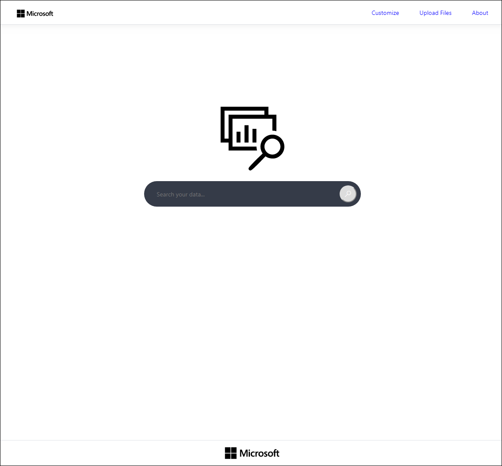
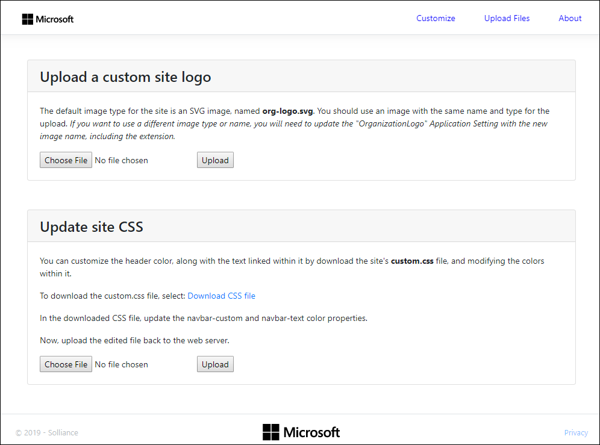
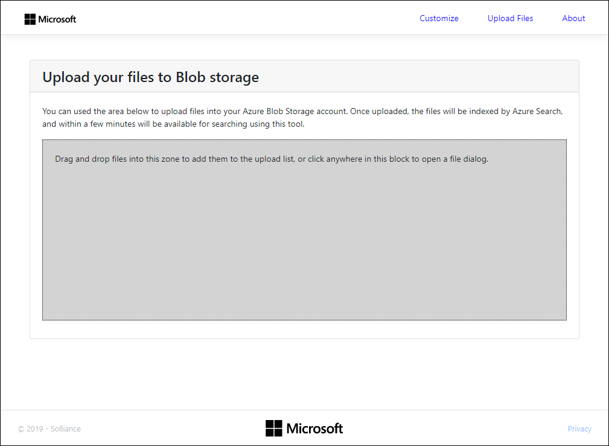
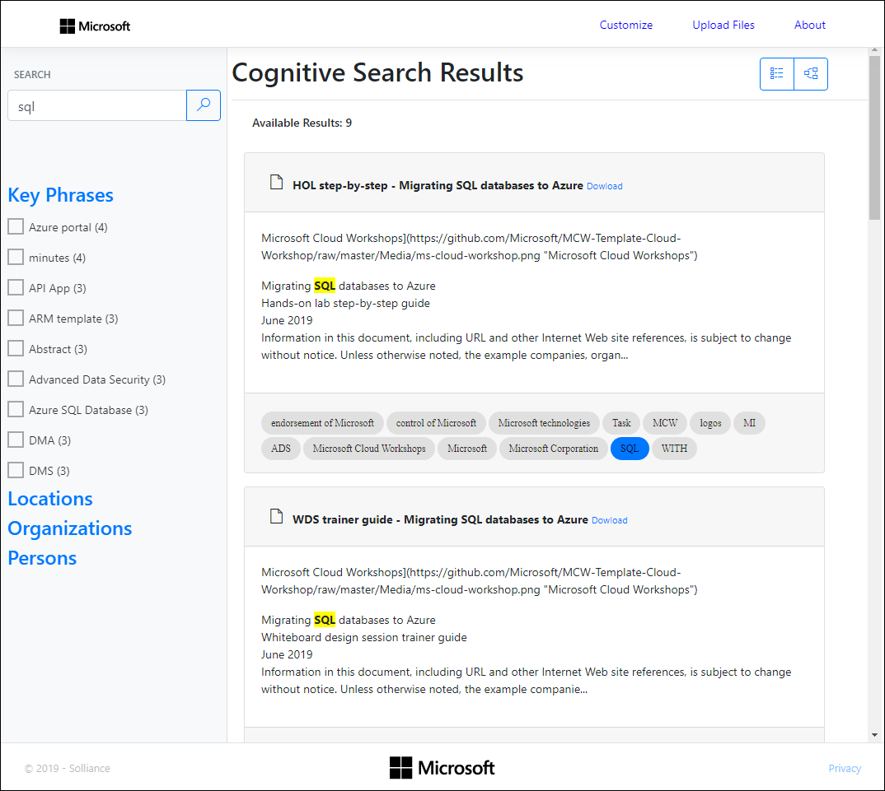
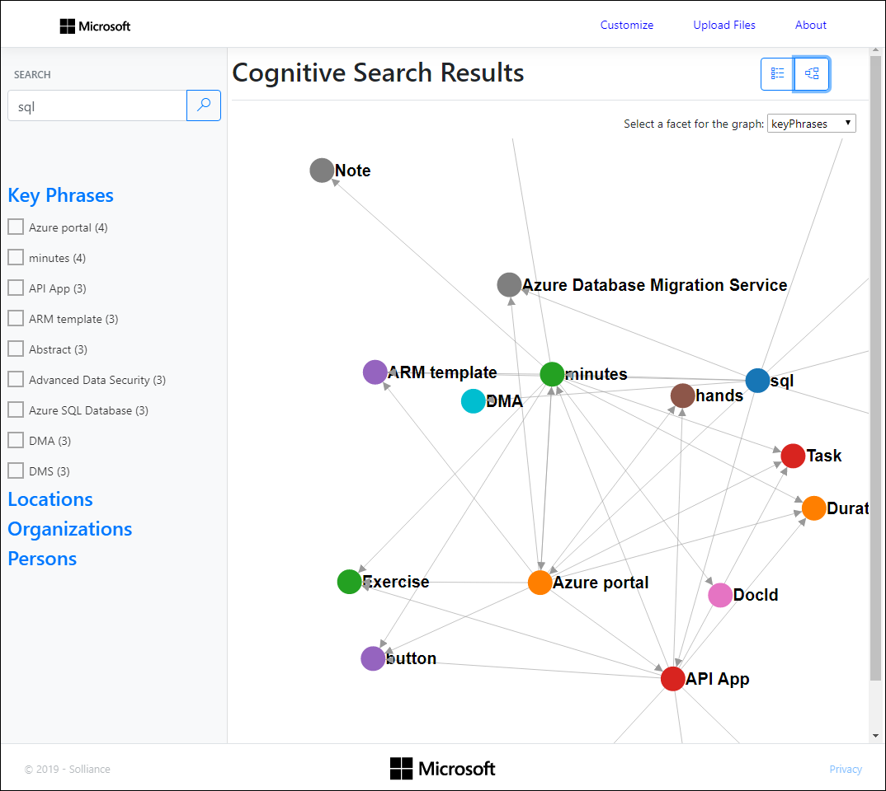
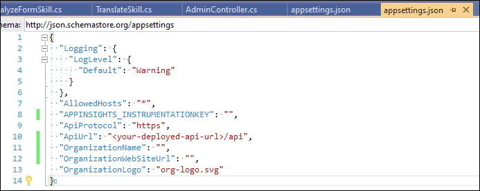
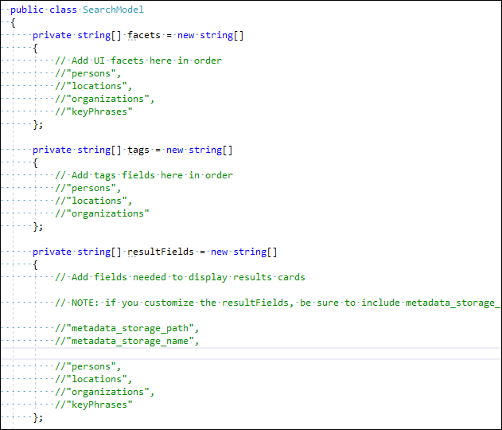

# Cognitive Search UI Template

This folder contains a basic web front end that can be used to quickly create a view of your search results.  With just a few simple steps, you can configure this template UI to query your newly created search index.

The Cognitive Search Template contains four projects:

1. **CognitiveSearch.Azure**: This is a basic .NET Core class library, which provides access to Azure services to the API layer.
2. **CognitiveSearch.CustomSkills**: This is an Azure Function project used for creating C# custom skills. For more information on custom skills, please see the the documentation in *03 - Data Science & Custom Skills*.
3. **CognitiveSearch.Web**: This is a .NET Core MVC Web app used as a Template UI for querying a search index. This is the focus of this README.
4. **CognitiveSearch.WebApi**: This serves as the data access layer for the application, exposing RESTful endpoints for interacting with your Azure Search Service and your Azure Blob Storage account.

## Getting started

In just a few steps, you can configure this template UI to query your search index. This template will render a web page similar to the following:



## Customize

From the home page, you can select the **Customize** link on the menu, to upload your own logo and set the header styles.



## Upload your data

Using the **Upload Files** page, you can upload documents directly from the application into the Azure Storage account that is the target of the Azure Search Index.



Once the files are uploaded, the search indexer will be automatically started, and within a few minutes, you will be able to search for data within the files you uploaded.

## Search your data

Once you've uploaded some files, use the home page to search your docments.

### List view

You can view your search results in a list view, to see a summary of the document, as well as associated tags,



Or you can switch to a graph view, get see the relationships between search terms and facets.



## Prerequisites

1. Visual Studio 2019 or newer

## 1. Update appsettings.json

There are two `appsettings.json` files you will be inserting information into to get started.

## Web API

In the `CognitiveSearch.WebApi` project update the following fields in the `appsettings.json` file to connect the API to your storage account, search index, and app insights account:


The settings in that you will need to update in the WebApi project's `appsettings.json` are below:

```json
// Optional
"APPINSIGHTS_INSTRUMENTATIONKEY": "<your-application-insights-instrumentation key>",
// The name of your search service
"SearchServiceName": "<your-search-service-name>",
// The key for your search service
"SearchServiceKey": "<your-search-service-key>",
// The API version of your search service. The current version is 2019-05-06, so you shouldn't have to change this.
"SearchServiceApiVersion": "2019-05-06",
// This is the name of your search index. "index-base" is the default value specified by the deployment project.
"SearchIndexName": "index-base",
// The name of your Azure Storage account.
"StorageAccountName": "<your-storage-account-name>",
// The access key for your Azure Storage account. Must have rights to read and write to Blob storage.
"StorageAccountKey": "<your-storage-account-key>",
// The name of the container in your Azure Storage account.
"StorageAccountContainerName": "<your-container-name>"
```

## Web

In the `CognitiveSearch.Web` project update the following fields in the `appsettings.json` file to connect to your API, as well as provide some information about your organization, that will appear on the pages:



The settings in that you will need to update in the Web project's `appsettings.json` are below:

```json
 // Optional
"APPINSIGHTS_INSTRUMENTATIONKEY": "<your-application-insights-instrumentation key>",
// This should remain set to https
"ApiProtocol": "https",
// This will be the deployed URL of your Web API + "/api"
"ApiUrl": "<your-deployed-web-api-url>/api",
// Name of your organization (e.g., Microsoft)
"OrganizationName": "<your-organization-name>",
 // The link to your organization's web site (e.g., https://www.microsoft.com)
"OrganizationWebSiteUrl": "<your-organization-web-site>",
// This is the default name and time of the site logo. If you would like to use a different image name and type, update this setting.
"OrganizationLogo": "org-logo.svg"
```

### Notes

1. *StorageContainerAddress* should be in the following format: **https://*storageaccountname*.blob.core.windows.net/*containername***
2. *InstrumentationKey* is an optional field. The instrumentation key connects the web app to Application Insights in order to populate the Power BI reports.

## 2. Update SearchModel.cs

At this point, your web app is configured and is ready to run. By default, all facets, tags, and fields will be used in the UI.

If you would like to further customize the search results, you can update the following fields in `CognitiveSearch.Azure/Search/SearchModel.cs`. You can select the filters that you are able to facet on, the tags shown with the results, as well as the fields returned by the search.



- **Facets**: Defines which facetable fields will show up as selectable filters in the UI. By default all facetable fields are included.
- **Tags**: Defines which fields will be added to the results card and details view as buttons. By default all facetable fields are included.
- **ResultFields**: Defines which fields will be returned in the results view. Only fields that are used for the UI should be included here to reduce latency caused by larger documents. By default all fields are included.

## 3. Add additional customization

This template serves as a great baseline for a Cognitive Search solution, however, you may want to make additional updates depending on your use case.

### Notes

Much of the UI is rendered dynamically by javascript. Some important files to know when making changes to the UI are:

1. **wwwroot/js/results.js** - contains the code used to render search results on the UI

2. **wwwroot/js/details.js** - contains the code for rending the detail view once a result is selected

Additionally, it may be useful to know that **Controllers/HomeController.cs** contains the API calls to the search index.
